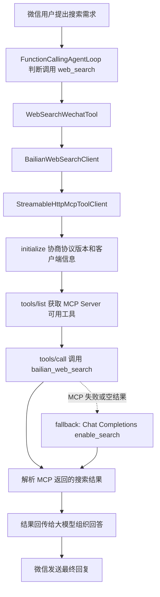

# OpenClaw CLI / WeChat Agent

OpenClaw 是一个基于 Java 17 + Spring Boot 的智能助手项目，支持 CLI 命令行入口和微信 iLink 入口。项目当前重点是微信端 Agent：用户可以在微信里发送文本、图片、语音、文件，系统会基于大模型 Function Calling 流程判断需求，并调用天气、地图、图片理解、图片生成、语音识别、语音合成、音色修改、文件解析、文档生成等工具完成回复。

## 1. 当前能力

### CLI 端

- 普通对话：直接输入文本时调用阿里百炼大模型。
- 基础命令：`/help`、`/version`、`/status`。
- 天气命令：`/weather 北京`。
- 微信控制命令：`/wechat start`、`/wechat status`、`/wechat stop`。
- CLI 端已移除图片生成能力，图片生成只保留在微信端工具中。

### 微信端

- 文本对话：默认由大模型接管，每条消息都会进入微信接收、上下文读取、Agent 推理和回复流程。
- Function Calling 工具调用：大模型可以按用户需求主动选择工具，工具执行结果会回传给模型继续推理。
- 多需求处理：一句话包含多个需求时，按用户表达顺序逐个处理。
- 上下文记忆：微信端使用 MySQL 保存用户、会话、消息、状态、摘要、工具日志和明确偏好。
- 天气查询：接入高德天气 API，并由大模型整理为自然语言回复和出行建议。
- 地图查询：支持地点搜索与介绍、两地驾车/公共交通/步行方案、周边美食/景点/商场推荐，并提供地图导航和票务平台搜索入口。
- 图片理解：支持微信图片附件、图片链接、data URI 图片，先描述图片内容，再结合后续问题对话。
- 图片生成：支持提示词优化、确认后生成、根据上下文修改图片，并发送图片给微信用户。
- 语音识别：支持微信语音下载、格式检测、必要时 ffmpeg 转码，然后调用 ASR。
- 语音合成：支持把指定文本或上一轮回答转成语音文件发送，长文本会自动拆段。
- 音色修改：支持筛选、试听、确认音色；用户明确确认后的音色偏好会通过微信记忆服务持久化。
- 文件解析：支持 PDF、Word、TXT、Markdown、Excel、PPT 等文件解析和内容分块。
- 文档生成：支持根据用户需求生成 Word、PDF、TXT、Markdown 文档并回传。
- 知识库：支持把文本、网页或文档内容保存到个人知识库，并通过 Qdrant 向量检索按上下文问答。
- 网页阅读：支持读取公开网页 URL，提取标题和正文，并可按用户要求保存到知识库。
- 网页搜索：支持通过可配置搜索客户端查询互联网资料；当前推荐接入阿里百炼 WebSearch MCP。

## 2. 技术栈

- Java 17
- Spring Boot 3.4.7
- Maven
- MySQL
- Flyway
- JDBC
- 阿里百炼 DashScope
- 高德天气 / 地图 Web 服务 API
- 微信 iLink SDK
- Apache PDFBox
- Apache POI
- ffmpeg，可选，用于语音转码

## 3. 整体架构

```text
用户入口
  ├─ CLI 终端
  └─ 微信 iLink

入口适配层
  ├─ ConsoleRunner
  └─ IlinkWechatClient / WechatBotService

会话编排层
  └─ WechatConversationService
       ├─ 读取微信上下文记忆
       ├─ 处理文本 / 图片 / 语音 / 文件输入
       ├─ 构造 Function Calling 请求
       ├─ 执行 Agent 工具调用循环
       ├─ 保存消息、状态、偏好和工具日志
       └─ 组合文本、图片、语音、文件回复

Agent 工具调用层
  ├─ FunctionCallingAgentLoop
  ├─ DashScopeFunctionCallingClient
  ├─ FunctionCallingToolSchemaConverter
  ├─ ToolCallValidator
  └─ WechatToolRegistry

微信工具层
  ├─ ChatWechatTool
  ├─ WeatherWechatTool
  ├─ MapWechatTool
  ├─ ImageGenerationWechatTool
  ├─ VoiceRecognitionWechatTool
  ├─ VoiceSynthesisWechatTool
  ├─ VoiceStyleWechatTool
  ├─ DocumentAnalysisWechatTool
  ├─ DocumentGenerationWechatTool
  ├─ KnowledgeAddWechatTool
  ├─ KnowledgeQueryWechatTool
  ├─ KnowledgeManageWechatTool
  ├─ WebReadWechatTool
  └─ WebSearchWechatTool

外部服务
  ├─ 阿里百炼文本大模型
  ├─ 阿里百炼图片理解模型
  ├─ 阿里百炼图片生成模型
  ├─ 阿里百炼语音识别 / 语音合成模型
  ├─ 高德天气 / 地图 Web 服务 API
  ├─ MySQL
  └─ 微信 iLink SDK
```

## 4. Function Calling 工作流

微信端默认使用标准 Function Calling Agent Loop。

```text
微信用户发送消息
  ↓
WechatBotService 接收消息并发送等待提示
  ↓
WechatConversationService 读取上下文记忆
  ↓
FunctionCallingAgentLoop 把用户消息、上下文、工具定义发送给大模型
  ↓
大模型返回 tool_calls
  ↓
Java 根据 tool_calls 执行对应 WechatTool
  ↓
工具结果作为 tool message 回传给大模型
  ↓
大模型继续判断是否需要调用下一个工具
  ↓
没有更多工具调用后，生成最终回复
  ↓
WechatBotService 按顺序发送文本、图片、语音或文件
```

当前默认配置：

```properties
AGENT_TOOL_CALLING_MODE=function-calling
AGENT_TOOL_CALLING_MAX_LOOP_ROUNDS=5
```

项目仍保留旧版 `prompt-json` 规划模式作为对比和回退，但主流程推荐使用 `function-calling`。

## 5. 微信端核心流程

### 文本消息

```text
文本消息
  → iLink 接收
  → 转换为 WechatIncomingMessage
  → 读取 MySQL 上下文
  → Function Calling Agent Loop
  → 调用聊天 / 天气 / 图片 / 语音 / 文件等工具
  → 保存用户消息、助手回复和工具日志
  → 微信发送最终结果
```

### 图片消息

```text
图片消息
  → 下载图片二进制
  → ImageInputResolver 识别图片来源和格式
  → DefaultImageUnderstandingService 调用视觉模型
  → 先描述图片内容
  → 图片描述和图片上下文进入会话记忆
  → 后续支持“把刚才那张图改成……”这类上下文修改需求
```

### 图片生成

```text
图片生成 / 图片修改需求
  → 大模型判断需要 image_generation 工具
  → ImageGenerationWechatTool 理解上下文和用户要求
  → 必要时先优化图片提示词
  → 调用 ImageGenerationService
  → DashScopeImageGenerationClient 请求图片生成接口
  → 下载生成图片
  → 微信端发送图片
```

如果用户明确说“先给我提示词，等我确认后再生成”，工具只会返回优化后的提示词，不会直接生成图片。

### 语音识别与语音合成

```text
语音消息
  → 下载微信语音
  → 优先使用 iLink 自带文本
  → 没有文本时检测音频格式
  → 必要时 ffmpeg 转码
  → 调用 ASR 得到文字
  → 文字重新进入文本 Agent 流程
```

```text
用户要求“用语音读一遍”
  → 大模型判断需要 voice_synthesis 工具
  → VoiceSynthesisWechatTool 选择要朗读的文本
  → 读取用户已保存音色偏好
  → 调用 TTS 生成音频
  → 长文本按微信发送稳定性拆分
  → 微信发送语音 / 音频文件
```

### 文件解析与文档生成

```text
用户发送文件
  → 下载文件
  → DocumentTypeDetector 根据后缀、MIME、文件头识别类型
  → DocumentParseService 解析正文、表格和段落
  → DocumentChunkService 分块
  → DocumentArchiveService 归档文件和分块信息
```

如果用户只发送文件但没有说明需求，系统会先追问“你想让我怎么处理这个文件”。如果用户提出总结、提炼、改写、生成文档等需求，则由对应工具处理。

## 6. 数据库说明

微信端使用 MySQL 保存上下文记忆，CLI 的普通对话仍保持轻量的命令行逻辑。

当前保存内容包括：

- 微信用户身份
- 会话记录
- 用户消息和助手回复
- 会话临时状态 JSON
- 用户明确偏好，例如音色
- 会话摘要
- 工具调用日志
- 文件元数据
- 文件分块内容
- 生成文档记录

首次运行前请创建数据库：

```bash
mysql -u root -p < docs/sql/create_database.sql
```

或者手动执行：

```sql
CREATE DATABASE IF NOT EXISTS openclaw
  DEFAULT CHARACTER SET utf8mb4
  COLLATE utf8mb4_unicode_ci;
```

然后在 `.env` 中配置：

```properties
MYSQL_URL=jdbc:mysql://127.0.0.1:3306/openclaw?useUnicode=true&characterEncoding=utf8&serverTimezone=Asia/Shanghai
MYSQL_USERNAME=root
MYSQL_PASSWORD=你的MySQL密码
FLYWAY_ENABLED=true
```

业务表由 Flyway 自动创建，不建议手动反复执行 `V1`、`V2` 迁移脚本。

更多说明：

- [数据库初始化说明](docs/DATABASE_SETUP.md)
- [数据库建库脚本](docs/sql/create_database.sql)

## 7. 项目目录

```text
src/main/java/com/example/spring/
  ├─ AgentClawApplication.java
  ├─ agent/                         # CLI 默认大模型对话
  ├─ chat/                          # 阿里百炼文本模型客户端和服务
  ├─ cli/                           # CLI 入口
  ├─ cli/command/core/              # CLI 命令接口、注册、分发、异常格式化
  ├─ cli/command/impl/              # help / version / status / weather / wechat 命令
  ├─ exception/                     # 项目基础异常
  ├─ tool/                          # 早期通用工具封装
  ├─ tool/protocol/                 # 工具调用协议
  │   ├─ function/                  # 标准 Function Calling 协议实现
  │   ├─ legacy/                    # 旧版 prompt-json 工具规划模式
  │   └─ validation/                # 工具参数校验
  ├─ weather/                       # 高德天气 API
  └─ wechat/
      ├─ adapter/                   # 微信客户端抽象与 iLink 适配
      ├─ bot/                       # 微信 Bot 生命周期、消息队列和发送逻辑
      ├─ conversation/              # 微信会话编排
      ├─ conversation/agent/        # Function Calling Agent 循环
      ├─ conversation/intent/       # 少量辅助意图识别
      ├─ conversation/memory/       # Agent 上下文拼装
      ├─ conversation/tools/        # 微信工具定义与工具实现
      ├─ document/                  # 文件解析、分块、归档和文档生成
      ├─ image/                     # 图片理解
      ├─ image/generation/          # 微信端图片生成
      ├─ knowledge/                 # 个人知识库：MySQL 元数据、DashScope Embedding、Qdrant 向量检索
      ├─ map/                       # 地点、路线、周边搜索与地图链接
      ├─ memory/                    # MySQL 记忆服务、兜底和清理任务
      ├─ model/                     # 微信入站消息模型
      ├─ web/                       # 网页阅读、网页正文提取、网页搜索和网页缓存
      └─ voice/                     # 语音识别、语音合成、音色管理
```

资源和文档目录：

```text
src/main/resources/
  ├─ application.properties
  └─ db/migration/
      ├─ V1__create_wechat_memory_tables.sql
      ├─ V2__create_wechat_document_tables.sql
      ├─ V3__create_wechat_image_tables.sql
      ├─ V4__create_wechat_knowledge_tables.sql
      └─ V5__create_wechat_web_tables.sql

docs/
  ├─ COLLABORATOR_BOOTSTRAP.md
  ├─ DATABASE_SETUP.md
  ├─ DOCUMENTATION_GUIDE.md
  ├─ MAP_TOOL.md
  ├─ PROJECT_STRUCTURE.md
  └─ sql/create_database.sql
```

更详细的包结构说明见 [docs/PROJECT_STRUCTURE.md](docs/PROJECT_STRUCTURE.md)。
协作者本地启动、MySQL、Qdrant、`.env`、百炼/MCP 和微信端验证步骤见 [docs/COLLABORATOR_BOOTSTRAP.md](docs/COLLABORATOR_BOOTSTRAP.md)。

## 8. 环境配置

复制配置模板：

```powershell
copy .env.example .env
```

常用配置：

```properties
# MySQL
MYSQL_URL=jdbc:mysql://127.0.0.1:3306/openclaw?useUnicode=true&characterEncoding=utf8&serverTimezone=Asia/Shanghai
MYSQL_USERNAME=root
MYSQL_PASSWORD=你的MySQL密码
FLYWAY_ENABLED=true

# Agent 模式
AGENT_TOOL_CALLING_MODE=function-calling
AGENT_TOOL_CALLING_MAX_LOOP_ROUNDS=5

# 高德天气
AMAP_WEATHER_KEY=你的高德Web服务Key

# 高德地图工具；留空时自动复用 AMAP_WEATHER_KEY
AMAP_MAP_KEY=
AMAP_MAP_STATIC_IMAGE_ENABLED=true

# 阿里百炼
DASHSCOPE_API_KEY=你的DashScope API Key
DASHSCOPE_BASE_URL=https://你的百炼工作空间Host/compatible-mode/v1
DASHSCOPE_CHAT_MODEL=qwen3.7-max-2026-06-08
DASHSCOPE_VISION_MODEL=qwen3.7-plus
DASHSCOPE_IMAGE_BASE_URL=https://你的百炼工作空间Host/api/v1
DASHSCOPE_IMAGE_MODEL=qwen-image-2.0-pro
# 如果语音识别地址和 DASHSCOPE_BASE_URL 不同，再配置这一项：
# DASHSCOPE_VOICE_BASE_URL=https://你的语音识别Host/compatible-mode/v1
DASHSCOPE_VOICE_MODEL=qwen3-asr-flash
DASHSCOPE_TTS_BASE_URL=https://dashscope.aliyuncs.com/api/v1
DASHSCOPE_TTS_MODEL=qwen3-tts-flash
DASHSCOPE_TTS_VOICE=Cherry

# 本地生成/归档目录
WECHAT_IMAGE_STORAGE_DIR=data/wechat/images
WECHAT_DOCUMENT_STORAGE_DIR=data/wechat/documents
```

说明：

- `.env` 保存真实密钥，不要提交到仓库。
- `DASHSCOPE_BASE_URL`、`DASHSCOPE_IMAGE_BASE_URL`、`DASHSCOPE_TTS_BASE_URL`、`WEB_SEARCH_ENDPOINT` 这类 Host/Endpoint 和 `DASHSCOPE_API_KEY` 一样属于个人配置，应放在 `.env` 中，不要写死到代码里。
- `application.properties` 中只保留环境变量占位，不保存个人 Host。
- 图片生成、语音识别、语音合成分别使用独立配置项，便于后续替换模型。
- `DASHSCOPE_VOICE_BASE_URL` 可以留空，默认复用 `DASHSCOPE_BASE_URL`；如果语音识别服务地址不同，再单独填写。
- 如果本机没有 ffmpeg，可以先关闭 `AUDIO_FFMPEG_ENABLED=false`，但部分语音格式可能无法识别。
- 项目启动后会输出一条 `OpenClaw 配置检查` 日志，只显示 Host、模型名和 Key 的脱敏状态，不会打印真实密钥。

## 9. 运行方式

如果本机还没有安装微信 iLink SDK，先执行：

```powershell
cd C:\Users\Lenovo\Desktop\wechat-ilink-sdk-java
mvn clean install -DskipTests "-Dmaven.compiler.source=8" "-Dmaven.compiler.target=8" "-Dmaven.compiler.release=8"
cd C:\Users\Lenovo\Desktop\openclaw_model
```

启动项目：

```powershell
mvn spring-boot:run
```

CLI 示例：

```text
你是谁
/help
/version
/status
/weather 北京
/wechat start
/wechat status
/wechat stop
exit
```

## 10. 微信端使用示例

```text
用户：北京今天天气怎么样，适合出门吗？
系统：调用天气工具，结合天气数据给出自然语言解释和出行建议。
```

```text
用户：从杭州东站到西湖怎么走，开车和坐地铁分别多久？
系统：调用地图工具，返回驾车和公共交通距离、预计时间、线路方案与高德导航链接。
```

```text
用户：帮我规划杭州东站、西湖断桥、灵隐寺、宋城的路线，顺路安排并生成完整路线图。
系统：解析多个地点，近似优化途经顺序，返回逐段文本方案、总距离、总耗时和带地点标记的路线图。
```

```text
用户：帮我推荐西湖附近的美食和景点，景点有票的话给我购票入口。
系统：调用地图周边搜索；景点只提供第三方票务平台搜索入口，实时价格和余票以平台页面为准。
```

```text
用户：帮我生成一张赛博朋克风格的橘猫图片
系统：优化提示词，调用图片生成工具，并把图片发送到微信。
```

```text
用户：这张图片里有什么？
系统：调用图片理解能力，先描述图片内容，再根据用户问题继续回答。
```

```text
用户：帮我生成三个随机故事，并用语音读一遍
系统：先生成故事文本，再调用语音合成工具，把故事内容转成语音发送。
```

```text
用户：换一个温柔的女声
系统：筛选候选音色。
用户：试听第一个
系统：发送试听音频。
用户：就用这个
系统：保存该用户音色偏好，后续语音合成优先使用该音色。
```

```text
用户：发送一个 PDF 文件
系统：先解析和归档文件；如果用户没说明需求，会追问想如何处理。
用户：帮我总结这个 PDF，并生成一份 Word
系统：读取文件上下文，先总结，再生成 Word 文件并发送。
```

## 11. 新增微信工具的开发方式

项目推荐把新增能力做成微信工具，而不是直接写死在主流程里。

基本步骤：

1. 在 `wechat/conversation/tools` 下新增一个实现 `WechatTool` 的类。
2. 定义工具名称、描述、参数和能力边界。
3. 在工具内部调用具体服务，例如地图、新闻、日程、文件分析等。
4. 让工具作为 Spring Bean 被 `WechatToolRegistry` 自动收集。
5. 如果工具参数比较严格，补充参数校验和测试。
6. 更新 README 或 `docs/PROJECT_STRUCTURE.md` 中的工具说明。

工具设计原则：

- 工具只做自己负责的事情。
- 用户意图交给大模型 Function Calling 判断。
- 工具参数必须清晰，不能让工具自己猜太多。
- 工具结果要返回给 Agent，让模型结合上下文继续判断下一步。
- 媒体工具要说明能力边界，例如文件大小、格式、是否支持编辑原图等。

## 12. 日志排查

iLink 接收日志示例：

```text
iLink 收到消息，messageId=..., fromUserId=..., contextToken=..., text=..., imageCount=..., voiceCount=...
```

微信 Bot 处理日志示例：

```text
微信收到消息，fromUserId=..., text=..., imageCount=..., voiceCount=...
微信消息进入处理队列，fromUserId=...
微信开始生成回复，fromUserId=..., text=...
微信回复发送完成，fromUserId=..., replyLength=..., hasImage=...
```

如果微信端没有回复，建议按这个顺序排查：

1. 是否出现 `iLink 收到消息`。
2. 是否出现 `微信收到消息`。
3. 是否进入微信消息处理队列。
4. 是否出现 `Function Calling Agent Loop 开始`。
5. 是否有工具调用失败日志。
6. 是否出现微信发送失败日志。
7. MySQL 是否连接正常，是否触发内存兜底。

日志级别可在 `.env` 中调整：

```properties
LOGGING_LEVEL_ROOT=WARN
LOGGING_LEVEL_WECHAT=INFO
LOGGING_LEVEL_WECHAT_BOT=DEBUG
LOGGING_LEVEL_WECHAT_CONVERSATION=DEBUG
LOGGING_LEVEL_ILINK=INFO
```

## 13. 测试与构建

运行测试：

```powershell
mvn test
```

干净构建：

```powershell
mvn clean test
```

只检查补丁格式：

```powershell
git diff --check
```

## 14. 协作注意事项

- 不要提交 `.env`、真实 API Key、微信登录态和本地生成文件。
- 数据库表结构通过 Flyway 迁移维护，不要直接修改已经发布过的迁移脚本。
- 新增表结构时创建新的 `V3__xxx.sql`、`V4__xxx.sql`。
- 新增工具时优先走 `WechatTool` + `WechatToolRegistry`，不要把业务逻辑堆进 `WechatConversationService`。
- 文档统一使用中文，方便学习、汇报和团队协作。

## 知识库与网页工具配置

新增的知识库和网页工具只覆盖微信端 Function Calling 流程，CLI 暂不接入。

本地需要先启动 Qdrant：

```powershell
docker run -d `
  --name openclaw-qdrant `
  -p 6333:6333 `
  -p 6334:6334 `
  -v qdrant_storage:/qdrant/storage `
  qdrant/qdrant
```

浏览器访问 `http://localhost:6333/dashboard` 可以查看 Qdrant 控制台。

`.env` 中需要配置：

```env
QDRANT_HOST=localhost
QDRANT_HTTP_PORT=6333
QDRANT_COLLECTION=openclaw_knowledge
QDRANT_DISTANCE=Cosine
QDRANT_VECTOR_SIZE=0

DASHSCOPE_EMBEDDING_MODEL=text-embedding-v4
DASHSCOPE_EMBEDDING_BASE_URL=${DASHSCOPE_BASE_URL}
DASHSCOPE_EMBEDDING_API_KEY=${DASHSCOPE_API_KEY}

KNOWLEDGE_CHUNK_SIZE=800
KNOWLEDGE_CHUNK_OVERLAP=120
KNOWLEDGE_TOP_K=5
KNOWLEDGE_MAX_CONTEXT_CHARS=6000
KNOWLEDGE_MIN_SCORE=0.2

WEB_SEARCH_PROVIDER=bailian-mcp
WEB_SEARCH_ENDPOINT=https://dashscope.aliyuncs.com/api/v1/mcps/WebSearch/mcp
WEB_SEARCH_API_KEY=${DASHSCOPE_API_KEY}
```

新增工具：

- `knowledge_add`：保存文本、网页或文档内容到知识库。
- `knowledge_query`：根据用户问题从 Qdrant 检索相关知识片段。
- `knowledge_manage`：列出、查看、筛选、改标题、改标签、删除、批量删除和重建索引入口。
- `web_read`：读取公开网页 URL，提取标题和正文，可保存到知识库。
- `web_search`：通过可配置搜索客户端搜索互联网资料；当前推荐阿里百炼 WebSearch MCP。

网页搜索/阅读与上下文记忆规则：

- 普通 `web_search` 默认只把标题、链接、摘要和 `[来源1]` 这类引用交给本轮大模型处理，不会把网页全文写入长期上下文。
- `web_search` 会在用户会话里临时记录最近 3 次搜索，每次最多 5 条结果。用户后续说“第二个网页详细看看”时，`web_read` 可以自动解析到刚才搜索结果里的第 2 个链接。
- `web_read` 会临时记录最近 5 个已阅读网页。用户后续说“上一个链接”“刚才那个网页”时，可以复用最近阅读过的网页上下文。
- 如果用户明确说“记住、保存、加入知识库、以后参考、后续回答时参考”，`web_search` 会把搜索摘要保存到知识库。
- `web_read` 默认只读取网页并返回正文片段；如果用户表达保存/记住意图，或模型显式传入 `save_to_knowledge=true`，才会把网页正文写入知识库。
- 后续用户说“根据之前保存的资料/知识库回答”时，Agent 会调用 `knowledge_query` 检索这些资料。
- 普通搜索/阅读结果属于“短期资源上下文”，只辅助当前和后续几轮引用；只有明确保存后才进入长期知识库。

知识库检索和入库优化：

- `knowledge_query` 会先用大模型把用户问题扩展成 2-3 个检索查询，再进行多路向量检索，最后按 `document_id + chunk_index` 去重并按相关度排序。
- `KNOWLEDGE_MIN_SCORE` 用于过滤低相关度片段，默认 `0.2`。如果知识库经常答非所问，可以适当调高；如果经常检索不到，可以适当调低。
- 长网页、长文档或文件类内容入库时，会尽量调用文本大模型提取标题、摘要和标签；失败时自动回退到规则提取，不会中断入库。
- 搜索结果可信度主要通过“标题 + URL + 来源 + 发布时间 + 引用编号”呈现。最终回答应尽量带上来源编号，方便用户回看。

知识库管理工具说明：

- `list`：列出知识资料，可按 `keyword`、`tags`、`source_type` 筛选。
- `detail`：查看单条知识资料的元信息，需要 `document_id`。
- `update_title`：修改知识资料标题，需要 `document_id` 和 `title`。
- `update_tags`：修改知识资料标签，需要 `document_id` 和 `tags`。
- `delete`：删除单条知识资料，需要 `document_id`，属于风险操作，需要二次确认。
- `batch_delete`：按 `document_ids` 或筛选条件批量删除，属于风险操作，需要二次确认。
- `reindex`：预留重建索引入口；当前版本没有持久化原始 chunk 全文，无法安全重建，会提示重新添加原始资料，不会假装重建成功。

### 百炼 WebSearch MCP 调用流程

`web_search` 在项目内部仍然是一个普通微信工具，但它的底层优先走 MCP Streamable HTTP 协议。MCP 不是普通 HTTP API，不能只 POST 一次 `tools/call`，而是需要先建立会话并初始化。



终端里可以通过以下日志判断是否真正进入 MCP：

```text
MCP Streamable HTTP initialize 开始
MCP Streamable HTTP tools/list 开始
MCP Streamable HTTP tools/call 开始，tool=bailian_web_search
```

如果 MCP 服务端临时没有返回可解析结果，会看到：

```text
百炼 MCP WebSearch 未返回可用结果，准备 fallback 到 Chat Completions 联网搜索
```

这时微信端仍然会尽量返回联网搜索摘要，不会因为 MCP 临时失败而直接无回复。
