# OpenClaw 项目功能与流程总览

> 盘点范围：当前工作区的 `src/`、`skills/`、`browser-mcp-sidecar/`、`xhs-sidecar/`、`src/main/resources/db/migration/` 与现有运行文档。本文描述的是已经落在代码中的能力；需要开关、Key、Docker 或第三方账户才能使用的能力会明确标注为“可选/条件启用”。

## 1. 项目定位

OpenClaw 是一个以 **Java 17 + Spring Boot 3.4.7** 为核心的智能体应用。它并非只有聊天能力，而是由五条主要产品链路组成：

1. **CLI 与微信 iLink 智能体**：接收文本、图片、语音、视频、文件，结合会话记忆、RAG 和 Function Calling 调用领域工具。
2. **提醒与报告能力**：支持一次性/重复提醒、延后/完成/取消、主动微信通知，以及超长回答转为临时 HTML 报告链接。
3. **医疗照护协同**：面向患者、家属和医护角色，提供身份绑定、可信记忆、每日签到、安全告警、照护计划、任务调度和审计。
4. **Web 管理与回调能力**：提供微信扫码与多连接管理、百度网盘 OAuth、支付回调、Agent 目标复盘、医疗控制台和小红书舆情管理台 API。
5. **小红书舆情系统**：采用 Python Sidecar 隔离采集，再由 Java 主程序完成入库、语义分析、风险事件、告警、报表与控制台展示。

核心原则是：**模型负责理解和决策，Java 工具负责执行，Skill 文件负责把业务边界与安全规则提供给模型**。工具注册、Skill 加载和外部 Sidecar 均与主对话编排解耦。

## 2. 全局架构

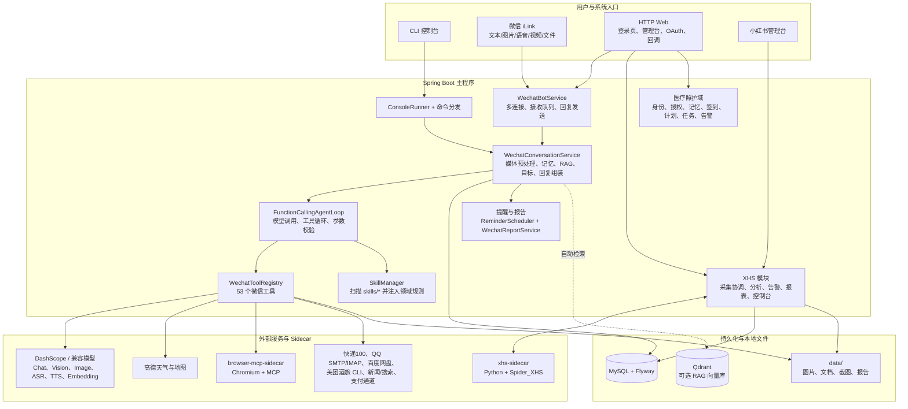

### 2.1 分层职责

| 层级 | 主要组件 | 职责 |
| --- | --- | --- |
| 入口层 | CLI、微信 iLink、HTTP、XHS Console | 接收用户输入、展示结果、处理回调或控制台操作。 |
| 编排层 | `WechatBotService`、`WechatConversationService` | 消息队列、输入媒体处理、会话记忆、RAG、任务目标、回复组装。 |
| 决策层 | `FunctionCallingAgentLoop`、DashScope Function Calling | 让模型决定回答或调用工具；执行多轮 `tool_calls` 后生成最终答复。 |
| 工具层 | `WechatToolRegistry`、53 个 `WechatTool` | 对每一项业务能力提供受参数校验、配置开关和领域规则约束的执行入口。 |
| 指令层 | `SkillManager`、`skills/*` | 运行时加载业务说明、确认要求和能力边界；不直接执行工具。 |
| 数据层 | MySQL、Flyway、Qdrant、文件目录 | 保存会话、用户偏好、媒资、业务订单、舆情、审计和向量知识。 |
| 集成层 | DashScope、高德、Sidecar、SMTP、百度网盘等 | 将第三方协议隔离在领域 Client/Service 中。 |

## 3. 入口与运行方式

### 3.1 CLI

CLI 由 `ConsoleRunner` 启动，经 `CommandDispatcher` 与 `CommandRegistry` 分发。非斜杠文本进入 `AgentService` / `ChatService`；命令由对应 `Command` 执行。

| 命令 | 功能 | 依赖 |
| --- | --- | --- |
| `/help` | 列出命令帮助。 | 无 |
| `/version` | 输出应用版本。 | 无 |
| `/status` | 输出运行状态。 | 无 |
| `/weather <城市>` | 直接查询天气。 | 高德天气 Key |
| `/wechat start` | 开始微信连接/扫码登录流程。 | 微信 iLink 配置 |
| `/wechat status` | 查询微信连接状态。 | 微信 iLink |
| `/wechat stop` | 停止微信连接。 | 微信 iLink |
| `/wechat reconnect <connectionId>` | 重连指定微信连接。 | 微信 iLink |
| `/patient` | 以患者身份启动微信扫码登录。 | 医疗身份模块 |
| `/caregiver` / `/parents` | 以家属身份启动微信扫码登录。 | 医疗身份模块 |
| `/doctor` | 以医生身份启动微信扫码登录。 | 医疗身份模块 |
| `/xhs start` | 打开小红书管理台。 | XHS Console 启用 |
| `/xhs status` | 查看小红书模块健康状态。 | XHS 模块 |
| `/xhs help` | 输出小红书 CLI 帮助。 | 无 |
| `/knowledge_import <session_key> <路径> [tags]` | 将 Markdown、TXT、JSON、JSONL 导入知识库。 | 知识库/Embedding 配置 |

### 3.2 微信 iLink

`IlinkWechatClient` 负责 iLink SDK 适配；`WechatBotService` 管理连接、轮询/接收、消息队列和按顺序发送文本、图片、语音、文件。HTTP 侧还提供扫码登录状态页和多连接管理接口。

- 输入类型：文本、图片、语音、视频、文件。
- 会话重置：仅当消息严格等于 `#new` 时关闭当前活跃会话，清理短期内存缓存，但保留长期偏好和历史记录。
- 多连接：可查看、添加、停止、重连多个 Bot 连接。
- 消息输出：一个回复可包含多段文字、图片、语音和文件，由 Bot 按顺序发回微信。

### 3.3 HTTP / Web

| 路径前缀 | 作用 |
| --- | --- |
| `/api/wechat-login/{sessionId}` | 返回扫码矩阵、状态和提示信息，供登录页轮询。 |
| `/api/clawbot/connections` | 查看、创建、停止、重连微信连接。 |
| `/api/netdisk/baidu/callback` | 接收百度网盘 OAuth 回调，完成 token 落库并恢复待完成动作。 |
| `/api/wechat-pay/notify` | 接收微信支付通知并交给支付服务验签处理。 |
| `/api/wechat-pay/refund/{paymentId}` | 提交退款请求；支付服务未实现时返回 501。 |
| `/api/agent-goals/review-actions/*` | 查看待人工复盘动作，并标记已应用或已忽略。 |
| `/api/care/v1/*` | 医疗照护初始化、Bearer 会话、患者/家属/临床端数据、计划、任务和告警 API。 |
| `/r/{reportId}` | 微信长回复临时 HTML 报告页面，带 TTL 和定时清理。 |
| `/api/xhs-console/*` | 小红书项目、采集、舆情、事件、报告、告警和授权管理 API。 |

## 4. 微信 Agent 主流程

默认推荐 `agent.tool-calling.mode=function-calling`；项目仍保留旧的 `prompt-json` 规划模式，作为兼容/回退路径。

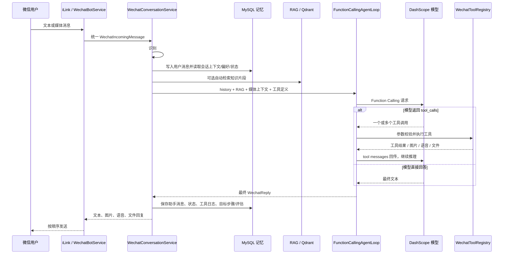

### 4.1 编排细节

1. **输入规范化**：微信消息被封装成 `WechatIncomingMessage`，媒体附件分别保留为图片、语音、视频、文件对象。
2. **`#new` 优先处理**：它不写入普通消息表；系统关闭该用户当前 `ACTIVE` 会话，并清理进程内短期文本/视频缓存。
3. **媒体预处理**：图片/文件会归档；语音优先采用 iLink 附带文字，缺失时进入 ASR；视频保持为待分析资源。
4. **记忆组装**：读取滚动摘要、最近消息、用户偏好、工具状态和媒体引用，形成短上下文。
5. **RAG 前置增强**：对项目、资料、方案等知识型问题，可先向量检索，再把命中片段作为独立的事实区块注入模型提示词；检索失败或无结果不阻断聊天。
6. **工具决策与循环**：模型收到可用工具 JSON Schema、相关 Skill 规则和会话上下文，最多按配置轮数继续调用工具（默认 5 轮）。
7. **安全校验**：`ToolCallValidator` 校验工具名、必填参数和枚举值；每个工具还会执行自己的业务确认、白名单和配置检查。
8. **结果持久化**：保存对话、状态、偏好、工具日志；启用 Agent Goal 后还写入目标、步骤、评价和失败复盘建议。

### 4.2 两种工具规划模式

| 模式 | 流程 | 适用状态 |
| --- | --- | --- |
| `function-calling` | 模型按标准协议返回 `tool_calls`；Java 执行后把 `tool` 消息回传，模型决定是否继续。 | 当前主流程，推荐。 |
| `prompt-json` | 模型输出旧格式 JSON 计划；Java 解析成 `ToolPlan` 后执行。 | 保留用于兼容、对比和回退。 |

### 4.3 动态 Skill 注入

项目内有 12 个运行时 Skill。`FileSystemSkillManager` 启动时扫描 `skills/*/SKILL.md`，校验 YAML frontmatter，并通过 `skill.json` 的 `tools` 数组把 Skill 与工具关联。

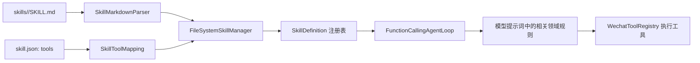

Skill 只提供“何时调用、缺什么信息、怎样确认、哪些事不能做”的指令，**不替代** `WechatToolRegistry`，也不执行脚本。

### 4.4 当前循环的防重复与呈现策略

- 对同名、同参数的工具调用计算签名，避免模型在单轮循环中反复执行相同动作。
- 同一 `voice_synthesis` 目标文本和音色只允许一次有效执行，防止重复发送语音。
- 对失败工具调用记录失败签名；提醒类工具返回“操作未完成”时会作为失败处理，避免模型把失败包装为成功。
- 已有 RAG 证据且用户未要求“最新、今天、联网、新闻、价格”等实时信息时，`web_search` 会被跳过，减少重复检索与外部调用。
- 图片、语音、文件、截图等可见媒体只由对应工具输出保留；最终回答会根据是否仍需补充确认文本，决定单独发送媒体还是“文本 + 媒体”。
- `WechatConversationMode` 会按医疗身份补充患者、家属或医生的对话规则，但权限校验仍由照护领域服务和 API 执行。

## 5. 输入媒体与知识链路

### 5.1 多模态输入分流

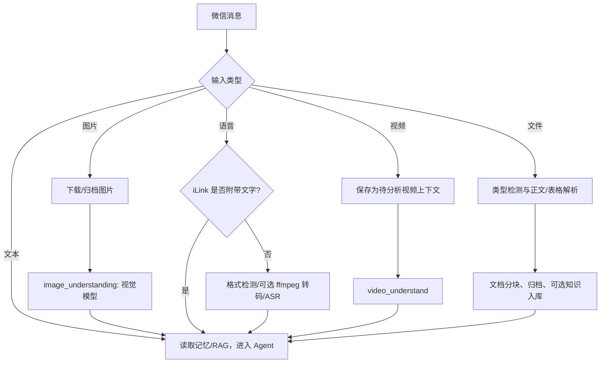

| 类型 | 处理能力 | 关键边界 |
| --- | --- | --- |
| 图片 | 图片内容描述、问答、基于最近图片的生成或改图。 | 先基于实际可见内容描述，不臆测不可见事实。 |
| 语音 | 优先直接使用 iLink 文本，否则 ASR；识别文本重回 Agent 流程。 | `ffmpeg` 为可选转码依赖；格式不支持时要求重发/换格式。 |
| 视频 | `video_understand` 分析场景、动作、字幕、关键事件和指定问题。 | 作为当前会话媒体上下文，不宣称具备未返回的内容。 |
| 文件 | PDF、Word、TXT、Markdown、Excel、PPT 的检测、解析、分块、归档。 | 解析不完整时需说明限制；无明确处理意图时先追问。 |
| 生成物 | 可生成 DOCX、PDF、TXT、Markdown、图片、语音。 | 通过 `WechatReply` 作为媒体回传，而不是仅返回本地路径。 |

### 5.2 记忆与 RAG

**会话记忆**保存在 MySQL：用户、会话、消息、状态、偏好、摘要、工具日志。MySQL 不可用时可退回到进程内 `InMemoryWechatMemoryFallback`，因此服务仍可以在短期内回复，但不会获得跨进程持久化。

**长期知识库**由 `KnowledgeIngestionService`、切块服务、DashScope Embedding 和 Qdrant 组成：

```mermaid
flowchart LR
    A[文本/网页/解析文档/CLI 导入] --> B[KnowledgeIngestionService]
    B --> C[KnowledgeChunkService]
    C --> D[DashScope Embedding]
    D --> E[(Qdrant 向量集合)]
    B --> F[(MySQL 元数据/日志)]
    Q[用户问题] --> G[WechatRagContextService]
    G --> H[KnowledgeSearchService\n改写、多路检索、去重、排序]
    H --> E
    H --> I[带 [知识N] 编号的 RAG 上下文]
    I --> J[FunctionCallingAgentLoop]
```

- `knowledge_add`：只有用户明确要求保存/记住时才写入长期知识库。
- `knowledge_query`：模型可在自动检索不足、用户指定标签或需要二次查询时主动调用。
- `knowledge_manage`：支持 list、detail、更新标题、更新标签、删除、批量删除、reindex；删除和批量删除需要二次确认。
- `web_read`：读取公开 URL，可在明确要求时保存到知识库。
- `web_search`：短期公开搜索结果，不自动入库；优先走 MCP Streamable HTTP，失败可降级到兼容联网搜索。

## 6. 全部微信工具清单（53 个）

> 工具由 Spring 自动发现后注册。某些工具受 `@ConditionalOnProperty` 或外部配置控制，关闭时不会出现在模型可选工具集合中。

### 6.1 通用、知识、网页与新闻（7 个）

| 工具 | 作用 | 主要流程与边界 |
| --- | --- | --- |
| `chat` | 通用对话、解释、总结、改写、计划。 | 专用工具能处理时不得用它伪造外部结果。 |
| `knowledge_add` | 保存长期复用资料。 | 仅在用户明确表示保存意图时入库。 |
| `knowledge_query` | 查询已保存资料片段。 | 相关性不足时应说明没有足够依据。 |
| `knowledge_manage` | 列表、详情、改标题/标签、删除、重建索引。 | 删除、批量删除、重建均属风险动作；`reindex` 不可安全重建时不能假报成功。 |
| `web_read` | 读取公开网页正文。 | 默认只读；是否保存由用户意图/参数决定。 |
| `web_search` | 搜索互联网公开资料。 | MCP 协议初始化、`tools/list`、`tools/call`；MCP 失败可降级。 |
| `news` | 新闻关键词检索与分页展示。 | 输出标题、来源、时间、摘要、链接；时效内容说明来源时间。 |
### 6.2 邮件（3 个）

| 工具 | 作用 | 主要流程与边界 |
| --- | --- | --- |
| `email_text_send` | 发送纯文本邮件。 | 白名单可直发；非白名单先创建短时草稿，再凭同会话确认 token 发送。 |
| `email_query` | 通过 IMAP 查询最近邮件、关键词、正文、已读状态和附件。 | 只能访问已配置邮箱；附件下载受大小和允许目录限制。 |
| `email_send` | 把当前微信文件、本地文件或代码目录作为附件发送。 | 发送前必须确认；目录会过滤 `.git`、`node_modules`、构建产物、日志和临时文件，并可压缩成 ZIP。 |

### 6.3 媒体与文档（8 个）

| 工具 | 作用 | 主要流程与边界 |
| --- | --- | --- |
| `image_understanding` | 识别、总结或回答图片问题。 | 支持多图批处理；先客观描述，再回答具体问题。 |
| `image_generation` | 根据提示词生成图片或基于上下文改图。 | 支持“先给提示词，确认后生成”；敏感/违规内容拒绝或安全改写。 |
| `video_understand` | 视频场景、事件、字幕和指定问题分析。 | 仅根据输入视频及工具输出回复。 |
| `voice_recognition` | 将当前语音附件转文本。 | 内部工具；优先 iLink 文本，必要时转码 + ASR。 |
| `voice_synthesis` | 将文本或上一轮最终答复转语音。 | 长文可分段；不能把中间草稿当最终播报。 |
| `voice_style` | 音色候选、试听、确认和偏好持久化。 | 必须“候选 → 试听 → 明确确认”后才保存偏好。 |
| `document_analysis` | 解析 PDF/Word/TXT/Markdown/Excel/PPT。 | 提取摘要、重点、表格、结构；没有具体诉求时追问。 |
| `document_generation` | 生成 DOCX/PDF/TXT/Markdown。 | 基于用户需求或最近文件上下文；缺少关键字段先追问。 |

### 6.4 出行、消费与交易前流程（7 个）

| 工具 | 作用 | 主要流程与边界 |
| --- | --- | --- |
| `weather` | 城市天气与出行建议。 | CLI 与微信均可调用；基于高德天气数据。 |
| `map_search` | 地点、详情、路线、多地点路线、周边推荐、路线图。 | 支持 `place_search`、`place_detail`、`route`、`multi_route`、`nearby_search`；多地点最多 12 个。 |
| `taxi_service` | 打车地点确认、询价、下单交接、订单/取消。 | 先确认起终点，再询价，再选择车型；支付、验证码、最终发单不由机器人代办。 |
| `meituan_travel` | 酒店、机酒火车、门票、度假、国内行程查询。 | 每轮一次查询；只提供结果/预订入口，不声称预订或支付成功。 |
| `shopping_advice` | 中立选购建议。 | 输入品类、预算、用途、偏好、限制；不查电商 API，不给商品链接或实时价格。 |
| `logistics_track` | 快递状态、最新位置、近期节点。 | 单号在调用/日志中脱敏；部分承运商需要手机号后四位，不持久化。 |
| `food_delivery` | 外卖地址、商家、菜单、购物车、预结算、下单、支付、进度、取消。 | 见第 7 章的严格确认状态机。 |
### 6.5 百度网盘（5 个）

| 工具 | 作用 | 主要流程与边界 |
| --- | --- | --- |
| `netdisk_auth` | 绑定、重绑、查看百度网盘授权。 | 只返回安全 OAuth 入口；不索取账号密码、Cookie 或完整 token。 |
| `netdisk_list` | 列出已授权用户指定目录内容。 | 返回文件名、路径、大小、修改时间等工具字段。 |
| `netdisk_save` | 保存 AI 生成的文本到个人网盘。 | 默认 Markdown；同名目标需确认，避免误覆盖。 |
| `netdisk_search` | 关键词或语义方式查找个人网盘文件。 | 仅在当前微信用户授权范围内查询。 |
| `netdisk_share` | 为个人网盘文件生成分享链接。 | 属于数据外发，先确认目标文件；仅保留安全 HTTP(S) 链接。 |

### 6.6 浏览器自动化（8 个，条件启用）

| 工具 | 作用 | 关键安全限制 |
| --- | --- | --- |
| `browser_open` | 打开允许的网页。 | 仅 HTTP(S)；默认只允许 `localhost`、`127.0.0.1`。 |
| `browser_current_state` | 读取当前 URL、标题、可见摘要、输入框、按钮、登录提示。 | 不读取 cookie、token、localStorage 或隐藏字段。 |
| `browser_read_page` | 读取当前页可见文字。 | 长度受限，避免返回整页敏感内容。 |
| `browser_click` | 按文本、描述或 CSS selector 点击元素。 | 删除、支付、购买、提交、发送、授权、登录等高风险点击需确认。 |
| `browser_type` | 向表单输入普通文本。 | 拦截密码、验证码、银行卡号、私钥等敏感输入。 |
| `browser_wait_for` | 等待 URL、标题、文本或 CSS 状态。 | 用于跳转/异步加载后再继续操作。 |
| `browser_screenshot` | 截图当前页面。 | 回传截图而不暴露容器路径。 |
| `browser_reset` | 重置受管浏览器会话，可选清 profile。 | 处理崩溃、锁死或持续失败。 |

浏览器工具经 `BrowserAutomationService -> BrowserMcpClient -> browser-mcp-sidecar -> Chromium` 调用。它默认关闭，且不使用宿主机 Chrome 登录态。

### 6.7 提醒（7 个）

| 工具 | 作用 | 主要流程与边界 |
| --- | --- | --- |
| `reminder_create` | 按明确日期/时间创建一次性、每日或每周提醒。 | 时间必须晚于当前时间；支持 ISO-8601 和时区。 |
| `reminder_create_after` | 按几分钟/小时/天后的相对时间创建一次性提醒。 | 原样传递 `delay_value` 与 `delay_unit`，相对延后不能超过 7 天。 |
| `reminder_list` | 按状态、关键词列出当前会话提醒。 | 默认返回有限条目；只查询当前会话。 |
| `reminder_update` | 修改标题、内容、时间或时区。 | 绝对时间与相对延后不能同时传入；仅允许修改活跃提醒。 |
| `reminder_cancel` | 按编号或标题取消提醒。 | 标题匹配多个时返回候选，不默认取消。 |
| `reminder_complete` | 将提醒标记为完成。 | 完成后不再主动发送。 |
| `reminder_snooze` | 延后当前或最近发送的提醒。 | 未提供编号/标题时使用当前会话最近一次已发送提醒；失败或取消状态不能直接延后。 |

提醒由 `ReminderScheduler` 抢占到期任务，`WechatReminderNotificationSender` 主动发送，支持失败重试、幂等和家属/患者通知目标绑定。

### 6.8 医疗照护（1 个，条件启用）

| 工具 | 作用 | 主要流程与边界 |
| --- | --- | --- |
| `care_agent` | 识别医疗身份，返回患者/家属/医生页面，检查绑定，联系医生，整理医生照护方案草稿，响应任务。 | 未登录先要求 `/patient`、`/caregiver` 或 `/doctor` 扫码；患者详情优先通过 Web 链接展示；医生方案先生成草稿，必须在审核页确认后才发送/激活。 |

医疗对话模式由 `WechatConversationMode` 注入：患者、家属和医生分别使用不同的表达和隐私边界，但实际授权始终由 `CareAuthorizationService`、`CarePermissions` 和后端 Bearer API 执行。

### 6.9 小红书舆情（7 个，条件启用）

| 工具 | 作用 | 边界 |
| --- | --- | --- |
| `xhs_monitor_collect` | 为已有项目提交关键词采集任务。 | 只采集与分析，不发布内容。 |
| `xhs_opinion_search` | 查询已采集、已分析的笔记与评论舆情。 | 只代表采集范围内的数据。 |
| `xhs_incident_list` | 查看聚合后的高风险事件。 | 输出可跟踪的事件信息和证据摘要。 |
| `xhs_incident_transition` | 更新事件处置状态并写入审计。 | 改变状态属于副作用，需明确目标。 |
| `xhs_daily_report` | 生成项目自然日日报。 | 结论、风险事件、建议动作基于已分析数据。 |
| `xhs_alert_subscribe` | 为当前微信用户订阅项目风险告警。 | 订阅阈值与冷却窗口持久化。 |
| `xhs_alert_acknowledge` | 确认当前用户收到的告警。 | 只确认属于该连接/用户的事件。 |

## 7. 需要确认的业务状态机

### 7.1 外卖点餐

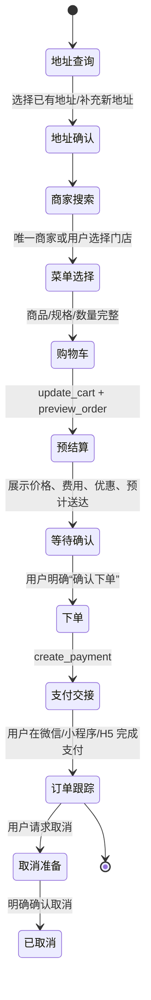

重要规则：地址变化后必须重新搜索商家并重新预结算；不能猜测过敏原或替换售罄商品；“好”“可以”等普通肯定不等于“确认下单”；用户本人完成最终支付。

### 7.2 打车

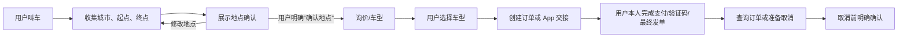

### 7.3 邮件、浏览器、网盘和知识库的副作用

| 动作 | 保护机制 |
| --- | --- |
| 向非白名单邮箱发信 | 先保存短时待确认草稿，后续同会话携带确认 token 才发送。 |
| 浏览器高风险点击 | 默认要求确认；同时禁止自动输入敏感凭据。 |
| 网盘生成分享链接 | 先确认具体文件，避免向外分享错误对象。 |
| 知识库删除/批量删除 | 二次确认；重建索引能力不安全时显式拒绝。 |
| 外卖真实下单/取消 | 需要固定确认语义与一次性预结算/确认 token。 |
| 打车取消 | 明确确认后才提交取消。 |
| 小红书事件流转 | 需要确认目标事件和目标状态，并写审计。 |

### 7.4 医疗照护计划与告警

医疗照护模块定位为“记录、协同、提醒和风险提示”，不提供诊断、处方、药量调整或紧急医疗服务替代。其主要角色是患者、家属/照护人、医生、护士、康复师、营养师和管理员。

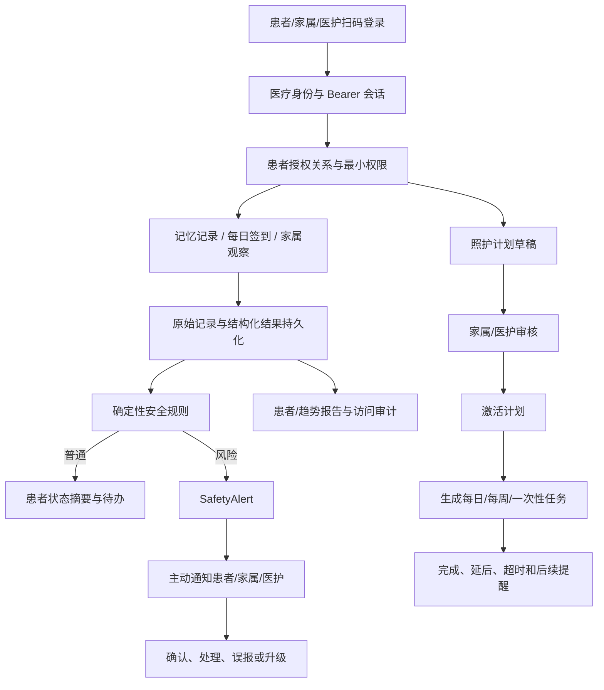

| 状态对象 | 状态流转 | 说明 |
| --- | --- | --- |
| 可信记忆 | `RECEIVED → EXTRACTED → WAITING_CONFIRMATION → VERIFIED / CORRECTED / REJECTED` | 原始内容先保存；未确认的内容不能当作可信事实返回。 |
| 照护计划 | `DRAFT → WAITING_REVIEW → APPROVED → ACTIVE → PAUSED → COMPLETED` | 涉及医学判断的计划必须由有权限医护审核；Agent 不得自行改变处方或禁忌。 |
| 安全告警 | `OPEN → ACKNOWLEDGED → RESOLVED / ESCALATED / FALSE_ALARM` | 跌倒、迷路、明确紧急求助等确定性规则可触发；模糊模型信号必须待确认。 |
| 照护任务 | 活跃、完成、延后、超时、失败 | 支持每天、每周和一次性任务；超时可通知患者和家属。 |

医疗 Web API 前缀为 `/api/care/v1`，统一使用 `Authorization: Bearer <access-token>` 和可选 `X-Request-Id`。覆盖：

- `bootstrap/users`：受 `CARE_BOOTSTRAP_KEY` 保护的患者、家属、医生等角色初始化；token 只回显一次，数据库仅保存 SHA-256 摘要。
- `patient/*`：状态、记忆、签到、告警、授权关系、计划和任务。
- `family/*`：已授权患者查询、记忆确认、告警确认/解决、计划提交与任务处理；可联系绑定医生。
- `clinical/*`：患者绑定/转交/解绑、趋势与记录查看、计划草稿、计划审核/激活/暂停/完成、任务和告警处理。
- `/medical-console/`：面向上述角色的静态控制台；微信内的 `care_agent` 返回具有会话约束的页面链接。

### 7.5 提醒与微信报告

```mermaid
flowchart LR
    A[用户在微信提出时间表达] --> B[Function Calling 选择 reminder_*]
    B --> C[(reminder_tasks)]
    C --> D[ReminderScheduler]
    D --> E[抢占到期任务、幂等检查、失败重试]
    E --> F[WechatReminderNotificationSender]
    F --> G[微信主动消息]
    G --> H[完成 / 延后 / 取消 / 创建后续提醒]

    R[长文本或多项结果] --> S[WechatReplyPresentationService]
    S --> T[生成临时 HTML 报告]
    T --> U[/r/{reportId}]
    U --> V[WechatReportCleanupScheduler 按 TTL 清理]
```

提醒相对时间严格使用 `reminder_create_after`，绝对日期和钟点使用 `reminder_create`；模型不得自行把“几小时后”换算成绝对时间。微信报告在回复超过文本长度或条目数量阈值时生成临时 Web 页面，避免长消息影响微信阅读体验。

## 8. 小红书舆情全流程

### 8.1 设计边界

- 采集 Sidecar 与 Spring Boot 主进程隔离，主程序不加载 Spider_XHS。
- Sidecar 只暴露只读搜索采集：`POST /internal/v1/jobs/search`、`GET /internal/v1/jobs/{jobId}`、`GET /health`。
- 不支持发布、点赞、关注、删除、私信或绕过平台限制。
- Sidecar 默认仅绑定 `127.0.0.1`，可启用 `X-Collector-Api-Key`。
- 作者昵称、头像、主页 URL 会清除；作者标识做 HMAC 伪匿名化。Cookie 不写入任务文件或日志。

### 8.2 采集、分析、事件、告警

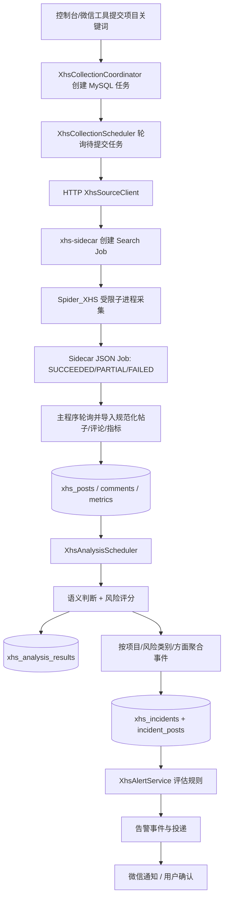

#### 采集层

1. 管理台或 `xhs_monitor_collect` 接收项目与关键词。
2. `XhsCollectionCoordinator` 创建任务；`XhsCollectionScheduler` 按配置轮询。
3. `HttpXhsSourceClient` 调用 Sidecar 创建并查询 Job 状态。
4. Sidecar 以受限环境变量运行 Spider_XHS 子进程，采集结果写入 JSON Job 文件。
5. Java 导入层标准化笔记、评论和指标，使用稳定 `note_url` 作为内容身份；受限 `access_url` 单独保存，且仅通过校验重定向暴露。
6. Sidecar 重启中的 Job 会被标为 `SIDECAR_RESTARTED`；登录过期返回 `AUTH_EXPIRED`；详情采集不可恢复失败会保留 `PARTIAL_COLLECTION`。

#### 分析与事件层

- `XhsAnalysisPipeline` 读取待分析帖子，调用规则或 LLM 语义分析器，产出情绪、方面、风险类别、摘要与解释性风险评分。
- 分析结果写入是完成标记，保证中途失败后的可重试性。
- 同一项目中，依据风险类别与主要方面生成稳定事件键，将相关帖子聚合到 `xhs_incidents`。
- 风险评分是解释性信号，不能直接视为法律、公关或品牌结论。

#### 告警与处置层

- `XhsAlertService` 根据项目规则、最低风险分数和冷却窗口创建告警事件。
- `XhsAlertScheduler` 拉取待投递记录，使用 `WechatXhsAlertNotifier` 发给已订阅的微信连接；失败按最大尝试次数记录。
- 用户可经微信或控制台确认告警；事件状态变化及说明写入 `xhs_incident_actions` 审计表。

### 8.3 授权管理

管理台支持：二维码授权、轮询二维码状态、在线校验、手动更新 Cookie、清除授权。

- 授权快照在 Sidecar 中使用加密且带完整性保护的本地文件保存。
- `XHS_COOKIES` 仅在不存在托管授权快照时作为首次导入回退。
- 连续 `AUTH_EXPIRED` 达到阈值后，授权断路器打开，新采集请求返回 HTTP 423，直到重新二维码或手动授权成功。

### 8.4 小红书管理台功能

管理台静态页面位于 `/xhs-console/index.html`，后端前缀为 `/api/xhs-console`：

| 功能 | API / 结果 |
| --- | --- |
| 系统健康与授权 | 健康状态、授权状态、校验、Cookie 更新、二维码登录、清除授权。 |
| 项目与关键词 | 创建、更新、删除项目；配置项目关键词。删除项目要求再次输入完整项目标识。 |
| 立即采集与任务 | 发起采集、查询 Job 状态和失败信息。 |
| 舆情查询 | 按项目、关键词、情绪、最低风险分数过滤；查看帖子详情。 |
| 原帖访问 | `GET /posts/{postId}/open` 只做安全校验后的 302 跳转；链接过期或缺失显示安全错误页。 |
| 风险事件 | 列表、状态过滤、写处置流转。 |
| 日报 | 查询自然日日报、实时生成 DOCX 下载。 |
| 定时报表 | 创建/更新/删除计划、手动排队运行、查看 run、重试投递、下载 DOCX/XLSX artifact。 |
| 告警 | 配置告警规则、查看事件、确认告警。 |

### 8.5 定时报表状态机

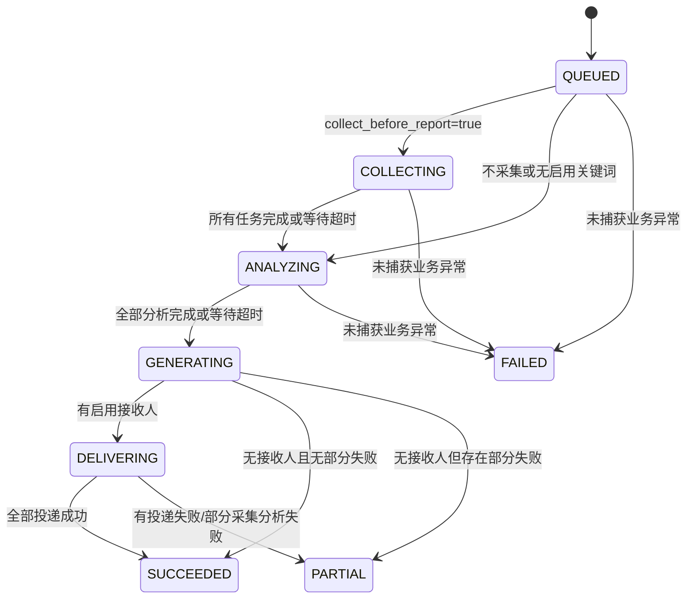

`XhsScheduledReportExecutionService` 在生成阶段按配置导出 DOCX 和 XLSX，保存 artifact、SHA-256、过期时间；`XhsReportArtifactCleanup` 定时清理过期产物。

## 9. 定时任务

| 调度组件 | 默认间隔/时间 | 作用 |
| --- | --- | --- |
| `WechatMemoryMaintenanceScheduler` | 配置驱动；另有每天 03:30 cron | 清理过期记忆并维护会话摘要。 |
| `RideOrderPollingService` | 默认 15 秒 | 更新打车订单状态。 |
| `ReminderScheduler` | 默认 15 秒 | 抢占到期提醒、处理发送成功/失败、重试与重复计划的下次执行时间。 |
| `WechatReportCleanupScheduler` | 默认 1 小时 | 清理已过 TTL 的微信临时 HTML 报告。 |
| `CareTaskScheduler` | 默认 15 秒 | 生成照护计划任务、处理任务到期与跟进通知。 |
| `CareNotificationScheduler` | 默认 15 秒 | 投递待发送医疗照护通知并按策略重试。 |
| `XhsCollectionScheduler` | 默认 10 秒 | 提交/轮询小红书采集 Job。 |
| `XhsAnalysisScheduler` | 默认 15 秒 | 处理待分析帖子。 |
| `XhsAlertScheduler` | 默认 10 秒 | 投递待发送舆情告警。 |
| `XhsScheduledReportDispatcher` | 默认 10 秒 | 为到期报表计划创建运行记录。 |
| `XhsReportArtifactCleanup` | 默认 1 小时 | 清理过期报表文件与元数据。 |
| `XhsNegativePostEmailScheduler` | 默认 10 秒 | 处理小红书负面帖子相关的邮件报告投递。 |

## 10. 数据模型与迁移

当前工作区的 Flyway 迁移目录包含 32 个 SQL 文件，覆盖会话、提醒、外卖、医疗照护、Agent 目标、网盘、支付、打车和小红书舆情等域。数据库创建只负责空库；业务表由 Flyway 自动建立。

```mermaid
erDiagram
    USERS ||--o{ CONVERSATIONS : owns
    CONVERSATIONS ||--o{ CONVERSATION_MESSAGES : contains
    CONVERSATIONS ||--o{ TOOL_EXECUTION_LOGS : records
    USERS ||--o{ USER_PREFERENCES : has
    USERS ||--o{ WECHAT_DOCUMENTS : uploads
    USERS ||--o{ WECHAT_IMAGES : owns
    USERS ||--o{ WECHAT_KNOWLEDGE_DOCUMENT : stores
    AGENT_GOALS ||--o{ AGENT_GOAL_STEPS : has
    AGENT_GOALS ||--o{ AGENT_GOAL_EVALUATIONS : has
    AGENT_GOALS ||--o{ AGENT_GOAL_REVIEW_ACTIONS : creates
    REMINDER_TASKS ||--o{ REMINDER_RECIPIENT_BINDINGS : targets
    MEDICAL_USERS ||--o{ MEDICAL_PATIENT_RELATIONS : authorizes
    MEDICAL_USERS ||--o{ CARE_MEMORY_EVENTS : records
    MEDICAL_USERS ||--o{ DAILY_CHECKINS : submits
    MEDICAL_USERS ||--o{ CARE_PLANS : owns
    CARE_PLANS ||--o{ CARE_PLAN_VERSIONS : versions
    CARE_PLANS ||--o{ CARE_TASK_INSTANCES : generates
    MEDICAL_USERS ||--o{ SAFETY_ALERTS : receives
    SAFETY_ALERTS ||--o{ MEDICAL_NOTIFICATIONS : notifies
    XHS_MONITOR_PROJECTS ||--o{ XHS_MONITOR_TERMS : configures
    XHS_MONITOR_PROJECTS ||--o{ XHS_COLLECTION_JOBS : creates
    XHS_MONITOR_PROJECTS ||--o{ XHS_POSTS : contains
    XHS_POSTS ||--o{ XHS_COMMENTS : includes
    XHS_POSTS ||--|| XHS_ANALYSIS_RESULTS : analyzed_as
    XHS_INCIDENTS ||--o{ XHS_INCIDENT_POSTS : aggregates
    XHS_INCIDENTS ||--o{ XHS_ALERT_EVENTS : triggers
    XHS_REPORT_SCHEDULES ||--o{ XHS_REPORT_RUNS : produces
    XHS_REPORT_RUNS ||--o{ XHS_REPORT_ARTIFACTS : stores
```

| 迁移域 | 主要表 | 说明 |
| --- | --- | --- |
| V1 会话记忆 | `users`、`conversations`、`conversation_messages`、`conversation_states`、`user_preferences`、`conversation_summaries`、`tool_execution_logs` | 微信用户、上下文、摘要、状态和调用审计。 |
| V2-V5 媒体与知识 | 文档/分块/生成文档、图片、知识文档/日志、网页缓存 | 支撑文件、图片、知识库和网页阅读。 |
| V6-V9 出行交易 | 打车地点确认/报价/订单/事件、支付订单/事件 | 支撑打车与支付交接。 |
| V10-V11 提醒 | 提醒任务、收件人绑定、状态增强和后续提醒 | 支撑一次性/重复提醒、主动通知和重试。 |
| V12 外卖 | 地址、草稿、预览、订单、事件、支付交接 | 支撑严格确认的外卖链路。 |
| V13-V19 医疗照护 | 医疗身份、照护记录、告警通知、计划/任务、登录会话、角色绑定、后续提醒 | 支撑患者、家属、医护端协同与审计。 |
| V20-V23 Agent 目标 | 目标、步骤、评估、复盘动作 | 记录可观测的任务执行与人工改进项。 |
| V25-V33 小红书舆情 | 项目、词、采集任务、帖子、评论、指标、分析、事件、告警、订阅、审计、访问 URL、定时报表、邮件报告扩展 | 当前工作区已将旧的 V12-V17/V22-V24 舆情迁移重新编号，避免版本冲突。 |

> 当前目录不再使用旧的 V12-V17、V22-V24 小红书文件名；不要把已执行环境中的旧版本文件直接与当前目录混合。升级前应先备份数据库，并用 Flyway 校验实际历史版本和校验和。

## 11. Sidecar 与部署拓扑

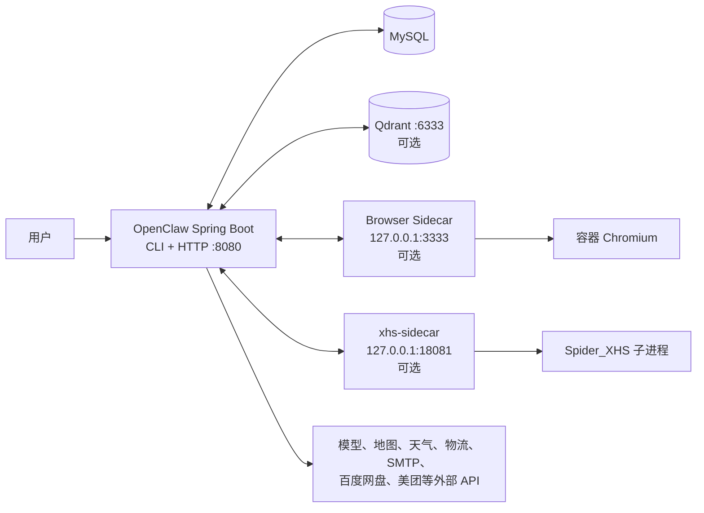

### 11.1 依赖分级

| 类型 | 组件 | 不可用时的影响 |
| --- | --- | --- |
| 基础运行 | JDK 17、MySQL、`.env` | MySQL 不可用时会话可短期 fallback，但不能视作完整生产配置。 |
| 模型能力 | DashScope 或兼容服务 | 普通聊天、Agent 决策、多媒体、Embedding 等不能正常工作。 |
| 可选增强 | Qdrant | 关闭/不可用时自动 RAG 退化，普通聊天继续。 |
| 可选增强 | browser-mcp-sidecar | 浏览器工具不注册或调用返回服务不可用。 |
| 可选增强 | xhs-sidecar | 小红书采集不能进行，历史查询/报告能力取决于已有数据。 |
| 按工具需要 | 高德、快递100、SMTP/IMAP、百度网盘、美团 CLI、支付 | 对应工具给出配置缺失或服务错误，不影响基础聊天。 |
| 医疗照护 | `CARE_BOOTSTRAP_KEY`、MySQL、微信连接 | 医疗身份初始化、主动照护通知和会话链接不可用；不会降低为无权限访问。 |

### 11.2 推荐启动顺序

1. 启动 MySQL，创建 `openclaw` 空库。
2. 按需启动 Qdrant、`browser-mcp-sidecar`、`xhs-sidecar` Docker 服务。
3. 从 `.env.example` 创建 `.env`，填写数据库、模型和启用模块的配置。
4. 运行 Spring Boot / JAR，确认 Flyway 与 `/status`。
5. 需要微信时执行 `/wechat start`；需要舆情控制台时执行 `/xhs start`。

## 12. 安全、隐私与降级策略

| 领域 | 当前代码/Skill 约束 |
| --- | --- |
| 凭据 | `.env` 不进仓库；配置报告使用 `SecretMasker` 脱敏；工具不应输出 Key、Token、Cookie、密码或堆栈。 |
| 浏览器 | 默认关闭、仅本地 host、不共享宿主机登录态、敏感输入拦截、高风险点击确认。 |
| 小红书 | 本地绑定、API Key、环境变量白名单、Cookie 不落 Job/日志、作者伪匿名化、只读采集。 |
| 网盘 | OAuth token 加密存储；不索取账号密码；分享/同名目标需要确认。 |
| 邮件 | 纯文本邮件保持白名单/确认 token；附件发送和目录压缩必须确认，且只允许白名单目录、大小上限与过滤后的文件；IMAP 查询受配置、附件目录和大小限制。 |
| 医疗照护 | Bearer 会话按角色和患者授权限制访问；敏感操作与查看写审计；未确认记忆不是可信事实；系统不诊断、不处方、不调整药物，紧急信号只提示联系家属、医护或急救服务。 |
| 交易 | 外卖、打车、支付均要求明确确认；用户完成支付、验证码、生物认证等最后步骤。 |
| RAG | 检索内容被视为事实资料，而非系统指令；RAG 失败不阻断普通聊天。 |
| 记忆 | 会话、偏好、摘要和工具状态可持久化；`#new` 只开启新会话，不删除历史或长期偏好。 |

## 13. 代码导航

| 关注点 | 首选入口 |
| --- | --- |
| 应用启动与依赖 | `pom.xml`、`AgentClawApplication.java`、`application.properties`、`.env.example` |
| CLI | `cli/ConsoleRunner.java`、`cli/command/core/`、`cli/command/impl/` |
| 微信接入 | `wechat/adapter/`、`wechat/bot/`、`wechat/login/` |
| 对话与工具循环 | `wechat/conversation/WechatConversationService.java`、`wechat/conversation/agent/FunctionCallingAgentLoop.java` |
| 工具清单 | `wechat/conversation/tools/`、`WechatToolRegistry.java` |
| Skills | `skills/*/SKILL.md`、`skills/*/skill.json`、`skill/` |
| 记忆与 RAG | `wechat/memory/`、`wechat/knowledge/`、`wechat/conversation/rag/` |
| 多媒体与文档 | `wechat/image/`、`wechat/voice/`、`wechat/document/` |
| 出行和消费 | `wechat/map/`、`wechat/taxi/`、`wechat/food/`、`wechat/commerce/`、`wechat/travel/` |
| 网盘/邮件/浏览器 | `wechat/netdisk/`、`wechat/email/`、`wechat/browser/` |
| 提醒与临时报告 | `wechat/reminder/`、`wechat/report/` |
| 医疗照护 | `wechat/care/`、`frontend/medical-console/`、`docs/PATIENT_CARE_COORDINATION_AGENT.md`、`docs/CARE_BACKEND_API.md` |
| 小红书 | `xhs/`、`xhs-sidecar/`、`static/xhs-console/` |
| 数据库 | `src/main/resources/db/migration/`、`docs/DATABASE_SETUP.md` |
| 部署 | `README-RUN.md`、`browser-mcp-sidecar/compose.yaml`、`xhs-sidecar/compose.yaml` |

## 14. 当前功能覆盖结论

项目当前已覆盖：多入口智能对话、多模态媒体处理、运行时工具/Skill、MySQL 记忆、Qdrant RAG、网页与新闻、文档与图片/语音、地图/天气/出行、选购/物流、邮件收取与附件发送、百度网盘、浏览器自动化、外卖/打车/支付交接、提醒与主动通知、微信长回复报告、患者/家属/医护照护协同，以及完整的小红书舆情采集到报表和邮件投递链路。

功能并非全部默认开启：模型、MySQL 是核心依赖；Qdrant、浏览器 Sidecar、小红书 Sidecar、医疗身份初始化、邮件、外卖和各第三方 API 按配置启用。系统对发送、支付、删除、分享、授权、下单、取消、提醒操作、医疗计划审核和事件流转设置了确认、权限、版本或白名单机制，且对工具失败设计了“局部功能降级、不阻断普通对话”的处理方式。
