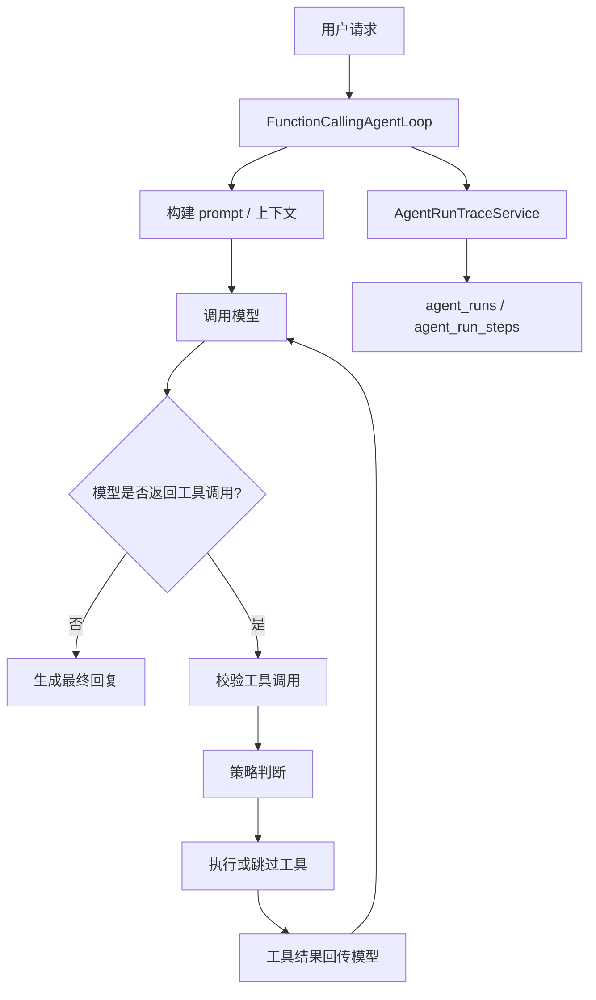

# OpenClaw 编排系统企业化运行手册

## 1. 系统定位

编排系统负责把“用户请求、上下文、模型、工具、策略、Trace、诊断接口”串成一次可控的 Agent 执行链路。它不是记忆系统，也不是工具业务系统本身；它的职责是决定 Agent 如何运行、何时调用工具、何时停止、如何留下可审计的执行证据。

当前编排系统已经具备企业化 Harness 的核心能力：

- Agent Loop 主流程。
- 停止策略与工具执行策略。
- 工具能力策略。
- Agent Run Trace 写入。
- 策略决策 Trace。
- Trace 查询服务与诊断 API。
- Trace 诊断脱敏。
- Trace 查询权限与访问审计。
- Trace 审计查询 API。
- Controller 职责拆分。
- 运行阶段视图。
- 统计摘要视图。

## 2. 核心模块边界

### 2.1 Agent Loop

核心类：

- `src/main/java/com/example/spring/wechat/conversation/agent/FunctionCallingAgentLoop.java`

职责：

- 构建系统提示词和用户提示词。
- 调用 Function Calling 模型。
- 接收模型返回的 tool calls。
- 校验工具调用参数。
- 执行业务工具。
- 将工具结果回传模型。
- 判断最终回复、失败、跳过或停止。
- 调用 Trace 服务记录关键事件。

### 2.2 Policy 层

核心类：

- `AgentStopPolicy`
- `ToolExecutionPolicy`
- `ToolCapabilityPolicy`

职责：

- 把 Agent Loop 里的策略判断从主流程中拆出来。
- 避免主循环里堆积大量 if/else。
- 让策略可以独立测试、独立演进。

### 2.3 Trace 写入层

核心类：

- `AgentRunTraceService`
- `JdbcAgentRunRepository`

核心表：

- `agent_runs`
- `agent_run_steps`

职责：

- 创建一次 Agent Run。
- 记录模型回合、工具调用、工具结果、策略决策和停止事件。
- 完成 run 并记录最终状态。

### 2.4 Trace 查询与诊断层

核心类：

- `AgentRunTraceQueryService`
- `JdbcAgentRunQueryRepository`
- `AgentRunDiagnosticMapper`
- `AgentRunPhaseClassifier`
- `AgentRunStatsCalculator`

职责：

- 查询单个 run 的完整 trace。
- 查询会话最近 run 列表。
- 输出脱敏后的诊断视图。
- 生成运行阶段视图。
- 生成统计摘要。

### 2.5 诊断访问控制与审计

核心类：

- `AgentTraceAccessPolicy`
- `AgentTraceDiagnosticAccessService`
- `AgentTraceAccessAuditService`
- `JdbcAgentTraceAccessAuditRepository`
- `AgentTraceAccessAuditQueryService`

核心表：

- `agent_trace_access_audit`

职责：

- 根据 `agent.trace.diagnostic.api-key` 判断诊断接口是否需要 API Key。
- 记录允许和拒绝的诊断访问。
- 支持按目标或访问者查询审计记录。
- 审计写入失败时不影响主诊断链路。

## 3. Agent Run 数据流



## 4. Trace 诊断 API

### 4.1 查询单个 Run

```http
GET /api/agent-runs/{runKey}
```

返回内容：

- run 基础信息。
- 脱敏后的用户输入、上下文摘要、最终回复摘要。
- `stats`：统计摘要。
- `phases`：连续运行阶段片段。
- `steps`：细粒度 step 明细。

### 4.2 查询会话最近 Run

```http
GET /api/agent-runs?sessionKey={sessionKey}&limit=20
```

返回内容：

- 最近 run 列表。
- 每个 run 的脱敏摘要。
- 每个 run 的 `stats`。

用途：

- 快速判断某个会话是否频繁失败。
- 快速判断某次 run 是否工具调用过多。
- 在不进入详情的情况下识别异常 run。

### 4.3 查询诊断访问审计

```http
GET /api/agent-runs/access-audit?targetType=RUN&targetKey={runKey}&limit=20
GET /api/agent-runs/access-audit?actor={actor}&limit=20
```

返回内容：

- 访问者。
- 动作。
- 目标类型和目标 key。
- 是否允许。
- 决策原因。
- IP 和 User-Agent。
- 创建时间。

## 5. 诊断访问头

### 5.1 API Key

```http
X-OpenClaw-Diagnostic-Key: <key>
```

当 `agent.trace.diagnostic.api-key` 未配置时，诊断接口允许访问，但仍会写审计。

当 `agent.trace.diagnostic.api-key` 已配置时，请求必须带正确 key，否则返回 403，并记录拒绝审计。

### 5.2 Actor

```http
X-OpenClaw-Actor: ops
```

用于审计记录调用者身份。缺省值为 `anonymous`。

## 6. 运行阶段字段

`stepPhase` 是从 `stepType` 派生出的运维阶段：

| stepType | stepPhase |
| --- | --- |
| `MODEL_ROUND` | `MODEL` |
| `TOOL_CALL` | `TOOL` |
| `TOOL_RESULT` | `TOOL` |
| `POLICY_DECISION` | `POLICY` |
| `STOP` | `TERMINAL` |

`phases` 会按 step 顺序聚合连续相同阶段，不会合并非连续片段。这样可以保留真实执行节奏。

## 7. 统计摘要字段

`stats` 字段含义：

| 字段 | 含义 |
| --- | --- |
| `totalStepCount` | step 总数 |
| `modelRoundCount` | 模型回合数 |
| `toolCallCount` | 工具调用发起次数 |
| `failedStepCount` | 失败 step 数 |
| `skippedStepCount` | 跳过 step 数 |
| `phaseCount` | 连续 phase 片段数 |

典型判断方式：

- `failedStepCount > 0`：优先进入详情查看失败工具或失败策略。
- `toolCallCount` 很高：检查是否有循环工具调用或任务拆分不足。
- `skippedStepCount` 很高：检查策略是否过度跳过，或模型是否重复请求同一工具。
- `phaseCount` 很高：说明执行路径较长，适合进入详情查看阶段切换。

## 8. 常见排障路径

### 8.1 用户反馈 Agent 没完成任务

1. 用 sessionKey 查询最近 Run。
2. 找到失败或复杂度异常的 run。
3. 查看 `stats.failedStepCount` 和 `stats.toolCallCount`。
4. 进入单个 Run 详情。
5. 查看 `phases` 判断失败发生在哪个阶段。
6. 查看对应 step 的 `stepType`、`toolName`、`status`、`outputSummary`。

### 8.2 怀疑工具被重复调用

1. 查看单个 Run 的 `steps`。
2. 搜索同一个 `toolName` 是否多次出现。
3. 查看 `POLICY_DECISION` step 是否出现 `SKIP_DUPLICATE_TOOL_CALL`。
4. 如果跳过策略生效，说明系统已保护重复调用。
5. 如果没有策略决策记录，检查 `ToolExecutionPolicy`。

### 8.3 怀疑诊断数据泄露

1. 调用诊断 API 检查响应是否含邮箱、手机号、token、secret、password 等原文。
2. 如果发现原文，优先检查 `AgentTraceRedactionPolicy`。
3. 检查 Controller 是否返回 Diagnostic View，而不是内部 Trace View。
4. 检查新增字段是否经过 mapper，而不是直接暴露底层对象。

### 8.4 怀疑未授权访问诊断接口

1. 检查是否配置 `agent.trace.diagnostic.api-key`。
2. 查询 `access-audit`。
3. 按 actor 或 target 查看拒绝记录。
4. 查看 `reason`：
   - `API_KEY_NOT_CONFIGURED`
   - `API_KEY_MISSING`
   - `API_KEY_MISMATCH`
   - `API_KEY_MATCHED`

## 9. 扩展规范

### 9.1 新增 step type

新增 `AgentRunStepType` 后必须同步：

- 更新 `AgentRunPhaseClassifier`。
- 更新 `AgentRunPhaseClassifierTests`。
- 如影响统计，更新 `AgentRunStatsCalculator`。

### 9.2 新增诊断 API

新增诊断 API 时必须：

- 复用 `AgentTraceDiagnosticAccessService`。
- 响应设置 `Cache-Control: no-store`。
- 返回 Diagnostic View，不直接返回内部 View。
- 写访问审计。
- 增加 WebMvc 测试覆盖允许、拒绝和脱敏。

### 9.3 新增策略判断

新增策略判断时建议：

- 放入 policy 类，而不是堆在 `FunctionCallingAgentLoop`。
- 使用 `POLICY_DECISION` 记录 Trace。
- metadata 只放可诊断信息，不放敏感原文。

### 9.4 新增统计字段

新增统计字段时必须：

- 更新 `AgentRunDiagnosticStatsView`。
- 更新 `AgentRunStatsCalculator`。
- 更新 Mapper、Controller、Repository 测试。
- 明确字段是从 steps 派生，还是从 run 表字段派生。

## 10. 当前收口结论

编排系统目前已经达到企业化 Harness 的第一阶段目标：

- 主流程可追踪。
- 策略可定位。
- 工具调用可审计。
- 诊断数据可脱敏。
- 诊断访问可授权、可审计。
- 运维视图可看阶段和统计。
- 后续扩展有明确边界。

后续如果继续演进，优先级建议是：

1. 指标导出。
2. 故障分类建议。
3. Replay / Debug UI。

这些属于增强项，不影响当前编排系统收口。
