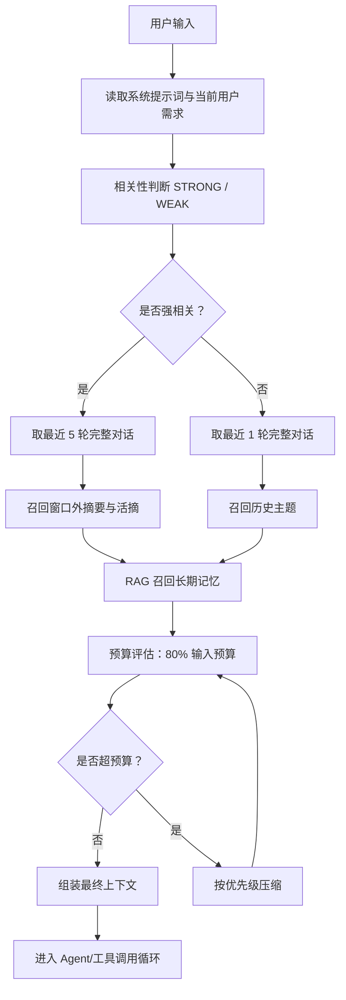

# Memory Graph 上下文机制中文实现方案

> 对应执行计划：`docs/superpowers/plans/2026-08-03-memory-graph-context.md`  
> 对应设计文档：`docs/superpowers/specs/2026-08-03-memory-graph-context-design.md`

## 目标

本次优化要把微信 Agent 的上下文机制从“固定最近对话 + 简单摘要/RAG”升级为 Memory Graph 驱动的上下文编排系统。系统在每轮用户输入到来时，先判断当前输入与当前会话主题的相关性，再按不同策略选取上下文：

- 强相关：保留系统提示词和当前用户需求，保留最近 N 轮完整对话，默认 N=5；再补充窗口外摘要、活摘和长期记忆。
- 弱相关：保留系统提示词和当前用户需求，只保留最近 1 轮完整对话；再补充历史主题和必要的长期记忆。
- 不相关/新话题：统一归入弱相关。
- 上下文总量：按 `(模型上下文窗口 - 输出预留 - 工具循环预留) * 0.8` 计算输入预算，超过预算时按优先级压缩。

## 核心判断标准

相关性只做二分类：

- `STRONG`：当前用户输入与当前上下文属于同一主题，主题连续性强。
- `WEAK`：当前用户输入与当前上下文主题差异明显，或者属于新话题。

这里的“相关”不是任务流程是否还在继续，而是主题是否一致。例如用户前面一直讨论 Memory Graph 设计，现在继续问“这个上下文窗口怎么压缩”，就是强相关；如果突然问“杭州天气怎么样”，就是弱相关。

## 总体流程

## 上下文分层

最终上下文分为以下几层：

1. 系统提示词：永不压缩。
2. 当前用户需求：永不压缩。
3. 最近完整对话：
   - 强相关默认保留最近 5 轮。
   - 弱相关默认保留最近 1 轮。
   - 压缩兜底时，强相关最近完整对话最低保留 2 轮。
4. 滑动窗口摘要：对最近窗口之外的本轮会话历史做摘要。
5. 活摘：从旧摘要或旧对话中抽取与当前主题强相关的信息。
6. 长期记忆：从 RAG 中召回稳定事实、长期偏好、项目背景。
7. 历史主题：弱相关时用于告诉模型用户之前聊过哪些方向，但不强行塞入完整上下文。
8. 资源上下文/RAG 上下文：继续兼容现有资源和知识库链路。

## 压缩优先级

超预算时，压缩顺序固定为：

1. 先压缩 RAG 长期记忆和历史主题。
2. 再压缩活摘。
3. 再压缩滑动窗口摘要。
4. 最后减少最近完整对话轮数，但强相关最低保留 2 轮。
5. 系统提示词和当前用户需求不参与压缩。

这样可以保证模型始终优先看到当前问题、核心规则和最贴近当前主题的短期上下文。

## 新增模块

新增包：`src/main/java/com/example/spring/wechat/context`

主要组件如下：

- `WechatContextProperties`：上下文机制配置，包括开关、窗口大小、预算参数。
- `ConversationRelevanceClassifier`：相关性判断接口。
- `RuleBasedRelevanceFallback`：模型判断失败或短回复场景下的规则兜底。
- `ModelConversationRelevanceClassifier`：模型驱动的强/弱相关判断器。
- `MemoryGraphRepository`：Memory Graph 元数据仓储接口。
- `MySqlMemoryGraphRepository`：MySQL 实现。
- `MemoryGraphRetriever`：召回最近轮次、摘要、活摘、主题节点。
- `LongTermMemoryRetriever`：通过现有 RAG/Knowledge 服务召回长期记忆。
- `ContextBudgetManager`：计算可用上下文预算。
- `ContextCompressor`：按优先级压缩上下文片段。
- `SlidingWindowSummaryService`：生成窗口外对话摘要。
- `ActiveExtractService`：生成当前主题活摘。
- `LongTermMemoryExtractor`：异步抽取长期记忆。
- `MemoryGraphMaintenanceService`：维护摘要、主题、活摘、长期记忆。
- `WechatContextAssembler`：组装最终结构化上下文文本。
- `WechatContextOrchestrator`：主编排入口，供 `WechatConversationService` 调用。

## 数据存储

新增 Flyway 迁移：

- `src/main/resources/db/migration/V34__create_memory_graph_tables.sql`

核心表：

- `wechat_memory_graph_nodes`：存储对话轮次、摘要、活摘、主题、长期记忆等节点。
- `wechat_memory_graph_edges`：存储节点之间的关系，例如 `NEXT`、`SUMMARIZES`、`DERIVED_FROM`、`SAME_TOPIC`。

长期记忆正文继续写入现有 Knowledge/RAG 链路，Memory Graph 只保存元数据、来源、主题和关系。

## 与现有系统集成

接入点是 `WechatConversationService`：

1. 每轮收到用户输入后，构造 `ContextBuildRequest`。
2. 调用 `WechatContextOrchestrator.build(...)`。
3. 如果新编排器可用且返回结构化上下文，则使用新上下文。
4. 如果新编排器异常或关闭，则回退到现有 `WechatAgentMemoryContextBuilder`。

这样可以渐进上线，不破坏当前对话、工具调用、RAG 和记忆服务。

## 实现任务顺序

1. 添加配置项和核心 DTO。
2. 实现强/弱相关判断。
3. 添加 Memory Graph MySQL 表和仓储。
4. 实现预算管理与压缩器。
5. 实现 Memory Graph 与 RAG 召回。
6. 实现上下文组装与总编排器。
7. 实现滑动窗口摘要、活摘、长期记忆异步维护。
8. 接入 `WechatConversationService`。
9. 跑上下文专项测试和现有 harness 回归测试。

## 验收标准

- 强相关时，最近 5 轮完整对话会进入上下文。
- 弱相关/新话题时，只保留最近 1 轮完整对话，并召回历史主题。
- 窗口外历史会被滑动摘要压缩。
- 当前主题相关的旧信息会进入活摘。
- 长期稳定记忆通过 RAG 召回。
- 最终上下文控制在 80% 输入预算以内。
- 系统提示词和当前用户需求永不被压缩。
- 新链路失败时自动回退到旧上下文构造器。
