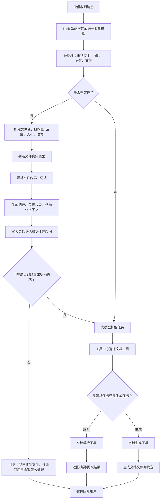

# 微信端文档解析与文档生成工具设计

## 1. 目标

在不改变现有项目主流程的前提下，为微信端新增一个“文档工具”能力，让系统可以：

- 识别并解析用户发送的文件；
- 把文件内容纳入上下文记忆，供后续追问和连续对话使用；
- 根据用户需求生成新的文档并回传给微信用户；
- 继续沿用当前“预处理 → 大模型拆解意图 → 工具中心执行工具”的框架，而不是改成关键词硬规则。

这个功能只面向微信端，不影响 CLI 端现有行为。

## 2. 设计原则

1. 不改主流程，只加工具。
2. 文件识别、文件解析、文档生成拆成独立职责。
3. 需求拆解继续交给大模型，工具只负责执行。
4. 第一版优先稳定和可维护，不追求一次性把所有文档场景做满。
5. 文件原文不直接长期存数据库，原始文件落本地磁盘，数据库只存元数据、摘要和分块结果。

## 3. 第一版支持范围

### 支持解析的文件类型

- PDF
- DOCX
- TXT
- MD
- XLSX
- PPTX

### 支持生成的文件类型

- DOCX
- PDF
- TXT
- MD

### 第一版不做的内容

- OCR 扫描件识别；
- 把原始文件直接存进 MySQL；
- 文件向量检索；
- 复杂模板引擎；
- Excel / PPT 的反向生成。

## 4. 推荐方案

### 方案 A：规则识别 + 解析器直连

优点是简单，缺点是容易把“文件类型判断”和“用户真实意图”绑死，扩展时会越来越像 if/else。

### 方案 B：大模型结构化拆解 + 工具中心执行

推荐方案。流程是：

用户发文件或文件相关问题 → 预处理文件信息 → 大模型输出结构化任务 → 工具中心调用文档解析或文档生成工具 → 返回结果。

优点：

- 能处理“总结一下”“根据刚才的文件生成报告”“把这份 PPT 改成 Word 汇报稿”这类复杂意图；
- 和现有天气、图片、语音工具的组织方式一致；
- 后续新增地图、日程、新闻、文件分析等工具时，只需要继续注册到工具中心。

### 方案 C：只做解析，不做生成

实现最轻，但和用户的预期差距较大，不作为第一版推荐。

### 结论

第一版采用方案 B。

## 5. 整体流程



## 6. 文件识别策略

文件识别不只看后缀，建议组合判断：

- 文件后缀名：快速预判；
- MIME 类型：校验微信/iLink 传来的类型；
- 文件头魔数：确认真实格式；
- SHA-256 哈希：用于去重、追踪、上下文关联。

识别顺序建议是：

1. 先用文件头和 MIME 确认是否为 PDF、DOCX、XLSX、PPTX、TXT、MD；
2. 再根据后缀做补充判断；
3. 如果类型不一致，以真实二进制格式为准；
4. 哈希只做唯一标识，不拿来判断类型。

## 7. 文件解析策略

### PDF

- 提取文本层内容；
- 如果有表格，尽量保留表格文本结构；
- 按页、标题、段落切块；
- 如果是扫描版 PDF，只提示当前第一版无法直接 OCR。

### DOCX

- 提取标题、正文、列表、表格；
- 尽量保留段落层级；
- 生成结构化摘要。

### TXT / MD

- 按行、段落、标题切块；
- MD 重点保留标题层级、列表和代码块边界。

### XLSX

- 按工作表读取；
- 保留表名、表头、行数据；
- 对大表只提取关键列和前后若干行样本，再汇总成摘要。

### PPTX

- 按幻灯片解析；
- 保留每页标题、要点、备注；
- 对长内容按页摘要，不把所有文本直接灌给模型。

## 8. 大文件处理

大文件不直接整份送给模型，而是先做分块：

1. 先提取标题、段落、表格、页码、工作表、幻灯片；
2. 每个块单独生成短摘要；
3. 再把块摘要合成全文摘要；
4. 后续提问时按问题检索相关块，而不是每次都送全文。

这样可以避免超长上下文，也更适合微信的对话模式。

## 9. 文档生成策略

第一版生成目标格式：

- DOCX：主输出格式；
- PDF：可作为生成结果；
- TXT / MD：用于纯文本或 Markdown 输出。

文档生成建议内置常用模板结构：

- 工作汇报
- 项目方案
- 会议纪要
- 学习笔记
- 总结报告
- Markdown 大纲

生成流程：

1. 大模型先理解用户需求和上下文；
2. 如果缺少关键字段（例如输出格式、目标用途），先追问；
3. 如果只是缺少字数、语气、排版风格，使用默认值；
4. 生成内容后交给文档生成工具导出；
5. 通过微信发送文件。

## 10. 文件发送时的交互

微信里如果用户只发了文件，机器人先不要沉默，也不要直接假装已经知道用户要什么。

推荐交互：

> 我已经收到文件《xxx.pdf》。  
> 你可以让我：  
> 1. 总结全文  
> 2. 提取重点  
> 3. 提取表格  
> 4. 生成汇报稿  
> 5. 根据它生成新的 Word / PDF / Markdown 文档

如果用户下一句说“总结一下”或“按这个生成 Word”，系统就继续沿用最近文件上下文。

## 11. 上下文设计

文件也要像文本、图片、语音一样进入会话上下文。

建议保存的上下文字段包括：

- 最近上传文件名；
- 文件哈希；
- 文件类型；
- 文件摘要；
- 文件分块内容；
- 用户最近一次关于该文件的要求；
- 用户是否已确认“生成”或“只解析”。

这样用户可以说：

- “总结刚才那个文件”
- “把它改成更正式一点”
- “按这个 PPT 生成一份 Word 汇报”

系统都能知道“它”指的是最近文件。

## 12. 存储设计

### 本地磁盘

原始文件先保存到本地磁盘，方便后续重新解析和生成。

建议目录按日期和用户分层，例如：

```text
data/wechat/documents/YYYY/MM/DD/userId/hash/fileName
```

### MySQL

MySQL 只保存：

- 文件元数据；
- 摘要；
- 分块文本；
- 解析状态；
- 生成记录；
- 和会话的关联关系。

不建议第一版把原始文件二进制存进数据库。

## 13. 工具设计

建议新增两个微信工具：

### 13.1 文档解析工具

职责：

- 接收文件；
- 判断文件类型；
- 提取内容；
- 返回摘要和结构化片段；
- 更新文件上下文。

### 13.2 文档生成工具

职责：

- 根据上下文和用户需求生成内容；
- 按目标格式导出；
- 返回可发送的文件字节和文件名；
- 必要时附带简短文字说明。

## 14. 预期文件边界

```text
src/main/java/com/example/spring/wechat/
  model/
    WechatIncomingFile.java
    WechatIncomingMessage.java
  bot/
    WechatReply.java
    WechatBotService.java
  conversation/
    WechatConversationService.java
    tools/
      DocumentAnalysisWechatTool.java
      DocumentGenerationWechatTool.java
      WechatToolRequest.java
  document/
    model/
      ParsedDocument.java
      DocumentChunk.java
      GeneratedDocument.java
    parser/
      DocumentParser.java
      PdfDocumentParser.java
      DocxDocumentParser.java
      TextDocumentParser.java
      XlsxDocumentParser.java
      PptxDocumentParser.java
    service/
      DocumentTypeDetector.java
      DocumentParseService.java
      DocumentChunkService.java
      DocumentContextService.java
      DocumentGenerationService.java
```

## 15. 需要改动的现有位置

- `WechatIncomingMessage`
  - 增加文件列表支持；
  - 增加 `hasFiles()`。

- `WechatToolRequest`
  - 增加文件上下文；
  - 让工具能访问最近文件摘要和文件元数据。

- `WechatReply`
  - 若文档生成返回文件，需要能表达“文件型回复”。

- `WechatBotService`
  - 支持把生成的文档文件通过微信发出去；
  - 支持文件只发过来时先追问。

- `WechatConversationService`
  - 识别文件消息；
  - 维护最近文件上下文；
  - 调用大模型拆解文档任务；
  - 注册和调用文档工具。

- `WechatToolRegistry`
  - 注册新的文档工具。

## 16. 风险与处理

### 风险 1：大文件太长

处理方式：分块、摘要、只把必要内容送给模型。

### 风险 2：扫描版 PDF 无法直接解析

处理方式：第一版明确不做 OCR，只提示用户当前限制。

### 风险 3：用户只发文件不说需求

处理方式：机器人主动追问，并给出可选操作。

### 风险 4：文件和文本上下文混淆

处理方式：给文件单独保存最近上下文，并明确最近文件优先级。

### 风险 5：文档生成格式不稳定

处理方式：第一版优先固定模板结构，先保证稳定输出。

## 17. 验收标准

1. 微信发送 PDF / DOCX / TXT / MD / XLSX / PPTX 后，系统能识别文件类型并回复。
2. 用户只发文件时，机器人会追问处理需求并给出可选项。
3. 用户说“总结一下”“生成 Word 文档”等请求时，系统能从最近文件上下文中正确找到目标文件。
4. 大文件会先被切块和摘要，不会直接整份喂给模型。
5. 文档生成后能通过微信正常发回用户。
6. 现有天气、图片、语音、文本对话功能不受影响。

## 18. 本次设计结论

第一版按以下方案执行：

- 文件解析：PDF、DOCX、TXT、MD、XLSX、PPTX
- 文档生成：DOCX、PDF、TXT、MD
- 存储方式：原始文件本地磁盘 + MySQL 元数据/摘要/分块
- OCR：不做
- 需求拆解：继续使用大模型结构化拆解
- 接入方式：作为微信工具加入工具中心，不改主流程

