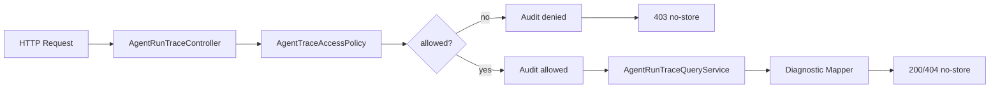

# 编排系统 Trace 查询权限与审计设计

## 背景

当前 Trace 查询 API 已经具备诊断视图和脱敏能力，但企业化排障体系还缺少两件事：

1. 谁可以查询 Trace。
2. 谁在什么时候查询了哪个 `runKey` 或 `sessionKey`。

项目目前没有统一 Spring Security 体系，如果此阶段直接引入完整鉴权，会把范围扩得过大。因此本阶段先做一个轻量但可演进的权限钩子和审计闭环。

## 目标

1. Trace 诊断 API 支持可选 API Key 保护。
2. API Key 未配置时维持现有开发体验：允许访问，但仍记录审计。
3. API Key 已配置时，请求必须携带正确的 `X-OpenClaw-Diagnostic-Key`。
4. 每次 Trace 查询尝试都记录审计事件，包括允许和拒绝。
5. 审计写入失败不能影响 API 主链路。
6. 不改动 Trace 写入、查询、脱敏的内部语义。

## 非目标

1. 本阶段不引入 Spring Security。
2. 本阶段不做用户登录态、角色、RBAC。
3. 本阶段不实现审计查询 API 或审计控制台。
4. 本阶段不对历史 Trace 数据做迁移。

## 配置设计

新增配置：

```properties
agent.trace.diagnostic.api-key=${AGENT_TRACE_DIAGNOSTIC_API_KEY:}
```

语义：

- 为空：诊断 API 不强制鉴权。
- 非空：必须在请求头传入 `X-OpenClaw-Diagnostic-Key`，且与配置值一致。

调用者身份：

- 请求头 `X-OpenClaw-Actor`。
- 缺失或空白时记为 `anonymous`。

## API 行为

### 查询单次 Run

`GET /api/agent-runs/{runKey}`

- 鉴权通过：继续查询 Trace。
- 鉴权失败：返回 `403 Forbidden`。
- 允许或拒绝都记录审计。
- 响应保持 `Cache-Control: no-store`。

### 查询会话最近 Run

`GET /api/agent-runs?sessionKey={sessionKey}&limit={limit}`

- 鉴权通过：继续查询最近 Run 列表。
- 鉴权失败：返回 `403 Forbidden`。
- 允许或拒绝都记录审计。
- 响应保持 `Cache-Control: no-store`。

## 审计表设计

新增表 `agent_trace_access_audit`：

- `id`：主键。
- `actor`：调用者，默认 `anonymous`。
- `action`：查询动作，例如 `FIND_RUN`、`FIND_RECENT_RUNS`。
- `target_type`：`RUN` 或 `SESSION`。
- `target_key`：`runKey` 或 `sessionKey`。
- `allowed`：是否放行。
- `reason`：策略原因，例如 `API_KEY_NOT_CONFIGURED`、`API_KEY_MATCHED`、`API_KEY_MISMATCH`。
- `remote_address`：请求 IP。
- `user_agent`：请求 UA。
- `created_at`：审计时间。

## 组件设计

- `AgentTraceAccessDecision`
  - 访问决策 DTO，包含 `allowed` 和 `reason`。

- `AgentTraceAccessPolicy`
  - 根据配置和请求头 API Key 判断是否允许。
  - 不依赖 HTTP 类型，便于单元测试。

- `AgentTraceAccessAuditEvent`
  - 审计事件 DTO。

- `AgentTraceAccessAuditRepository`
  - 审计写入接口。

- `JdbcAgentTraceAccessAuditRepository`
  - JDBC 审计写入实现。

- `AgentTraceAccessAuditService`
  - 审计服务门面，负责吞掉审计写入异常，避免影响 API 主流程。

- `AgentRunTraceController`
  - 执行访问策略判断。
  - 无论允许或拒绝都调用审计服务。
  - 拒绝时直接返回 `403`。

## 数据流



## 测试策略

采用 TDD：

1. 先写 `AgentTraceAccessPolicyTests`，验证未配置允许、配置后匹配允许、配置后缺失/错误拒绝。
2. 写 `JdbcAgentTraceAccessAuditRepositoryTests`，验证审计事件能写入数据库。
3. 写 `AgentTraceAccessAuditServiceTests`，验证审计写入失败会被吞掉。
4. 更新 `AgentRunTraceControllerTests`，验证：
   - 鉴权通过时返回原有诊断响应并记录 allowed audit。
   - 鉴权失败时返回 `403` 并记录 denied audit。
5. 运行应用上下文测试，确认新增组件和 migration 可用。

## 后续扩展

1. 增加审计查询 API。
2. 接入 Spring Security，把 actor 替换为真实登录用户。
3. 为高风险 Trace 查询增加二次确认或审批。
4. 增加审计保留周期和归档策略。
