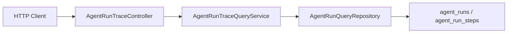

# 编排系统 Trace 查询 API 设计

## 背景

上一阶段已经补齐了 Agent Run Trace 的后端查询能力，可以按 `runKey` 查询完整轨迹，也可以按 `sessionKey` 查询最近运行列表。但当前能力仍停留在 Java Service 层，控制台、排障脚本和后续运维页面无法直接消费。

本阶段目标是补一个小而稳的内部诊断 REST API，把 Trace 查询能力从“后端可调用”推进到“外部可诊断”。

## 目标

1. 提供按 `runKey` 查询单次 Agent Run 完整轨迹的 HTTP 接口。
2. 提供按 `sessionKey` 查询最近 N 次 Agent Run 摘要的 HTTP 接口。
3. 接口保持只读，不修改任何运行状态。
4. 响应增加 `Cache-Control: no-store`，避免包含用户原文、上下文摘要、工具输入输出摘要的诊断数据被浏览器或代理缓存。
5. 保持 Controller 很薄，只做 HTTP 语义转换，查询逻辑继续留在 `AgentRunTraceQueryService`。

## 非目标

1. 本阶段不实现控制台 UI。
2. 本阶段不新增权限/鉴权体系；项目目前 API 层没有统一安全框架，权限治理应作为单独阶段处理。
3. 本阶段不做字段脱敏策略。Trace DTO 已经是摘要字段，但仍可能包含敏感信息，所以先通过 `no-store` 降低缓存风险。
4. 本阶段不新增数据库表或 migration。

## API 设计

### 查询单次完整 Trace

`GET /api/agent-runs/{runKey}`

语义：

- 找到运行：返回 `200 OK`，body 为 `AgentRunTraceView`。
- 找不到运行：返回 `404 Not Found`。
- 响应统一带 `Cache-Control: no-store`。

### 查询会话最近运行列表

`GET /api/agent-runs?sessionKey={sessionKey}&limit={limit}`

语义：

- `sessionKey` 为必填参数，由 Spring MVC 处理缺失参数。
- `limit` 默认值为 20。
- limit 规整继续由 `AgentRunTraceQueryService` 处理，Controller 不重复业务规则。
- 返回 `200 OK`，body 为 `List<AgentRunSummaryView>`。
- 响应统一带 `Cache-Control: no-store`。

## 组件设计

- `AgentRunTraceController`
  - `GET /api/agent-runs/{runKey}` 调用 `AgentRunTraceQueryService.findRun(runKey)`。
  - `GET /api/agent-runs` 调用 `AgentRunTraceQueryService.findRecentRuns(sessionKey, limit)`。
  - 使用 `ResponseEntity` 设置 HTTP 状态码和 no-store 缓存头。

数据流：

## 测试策略

采用 TDD：

1. 先写 `AgentRunTraceControllerTests`。
2. 运行测试确认红灯：`AgentRunTraceController` 不存在导致编译失败。
3. 实现最小 Controller。
4. 运行 Controller 测试确认接口状态码、JSON 字段、Service 参数传递、no-store header。
5. 运行应用上下文测试，确认新增 Controller Bean 不破坏启动。

## 后续扩展

后续可以拆成独立阶段继续补：

1. API 权限与诊断角色控制。
2. Trace 字段展示级脱敏。
3. 控制台页面或 CLI 调试命令。
4. 按失败状态、工具名、策略决策类型的聚合查询接口。
