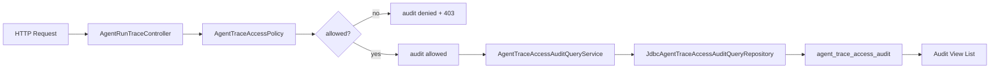

# 编排系统 Trace 审计查询 API 设计

## 背景

上一阶段已经为 Trace 诊断 API 增加了可选 API Key 权限钩子，并把每次查询尝试写入 `agent_trace_access_audit`。当前短板是审计只能写入，不能通过后端接口直接查询；排障时仍需要手写 SQL。

本阶段目标是把 Trace 审计从“可写入”推进到“可查询、可运维查看”。

## 目标

1. 按 `targetType + targetKey` 查询某个 Run 或 Session 的最近审计事件。
2. 按 `actor` 查询某个调用者最近的 Trace 审计事件。
3. 查询接口复用上一阶段的访问策略：
   - 未配置 API Key 时允许访问并审计。
   - 配置 API Key 后必须带正确 `X-OpenClaw-Diagnostic-Key`。
4. 查询审计本身也写入 `agent_trace_access_audit`，形成自审计。
5. 查询层保持只读，不新增 migration，不修改表结构。

## 非目标

1. 本阶段不做 UI。
2. 本阶段不做复杂聚合统计。
3. 本阶段不实现按时间范围分页，只做最近 N 条查询。
4. 本阶段不引入 Spring Security。

## API 设计

### 按目标查询

`GET /api/agent-runs/access-audit?targetType=RUN&targetKey=agent-run-1&limit=20`

语义：

- `targetType` 和 `targetKey` 同时存在时，按目标查询。
- 结果按 `created_at DESC, id DESC` 返回。
- 响应带 `Cache-Control: no-store`。
- 当前查询动作审计为：
  - `action = FIND_ACCESS_AUDIT`
  - `target_type = AUDIT_TARGET`
  - `target_key = RUN:agent-run-1`

### 按调用者查询

`GET /api/agent-runs/access-audit?actor=ops&limit=20`

语义：

- `actor` 存在且目标参数缺失时，按 actor 查询。
- 结果按 `created_at DESC, id DESC` 返回。
- 响应带 `Cache-Control: no-store`。
- 当前查询动作审计为：
  - `action = FIND_ACCESS_AUDIT`
  - `target_type = AUDIT_ACTOR`
  - `target_key = ops`

### 参数错误

- 既没有 `targetType + targetKey`，也没有 `actor`：返回 `400 Bad Request`。
- 只提供了 `targetType` 或只提供了 `targetKey`：返回 `400 Bad Request`。
- `limit <= 0` 使用默认 20。
- `limit > 100` 裁剪到 100。

## 组件设计

- `AgentTraceAccessAuditView`
  - 对外展示审计行。
  - 包含 id、actor、action、targetType、targetKey、allowed、reason、remoteAddress、userAgent、createdAt。

- `AgentTraceAccessAuditQueryRepository`
  - 只读查询接口。
  - `findRecentByTarget(targetType, targetKey, limit)`
  - `findRecentByActor(actor, limit)`

- `JdbcAgentTraceAccessAuditQueryRepository`
  - JDBC 查询实现。

- `AgentTraceAccessAuditQueryService`
  - 负责参数规整、limit 归一化、异常兜底。

- `AgentRunTraceController`
  - 新增 `/access-audit` endpoint。
  - 复用 `AgentTraceAccessPolicy` 和 `AgentTraceAccessAuditService`。

## 数据流

## 测试策略

采用 TDD：

1. 写 `JdbcAgentTraceAccessAuditQueryRepositoryTests`，通过已有写入仓储插入审计事件，再验证按 target / actor 查询。
2. 写 `AgentTraceAccessAuditQueryServiceTests`，验证 limit 默认、limit 上限、空参数、仓储异常兜底。
3. 更新 `AgentRunTraceControllerTests`，验证：
   - 按 target 查询审计。
   - 按 actor 查询审计。
   - 参数错误返回 400。
   - 权限拒绝返回 403 且不调用查询服务。
4. 运行相关测试和应用上下文测试。

## 后续扩展

1. 审计查询独立 Controller，减少 `AgentRunTraceController` 体积。
2. 按时间范围、allowed、reason 查询。
3. 审计聚合统计：调用者 TopN、拒绝次数、敏感 Trace 查询频率。
4. 审计保留周期与归档策略。
