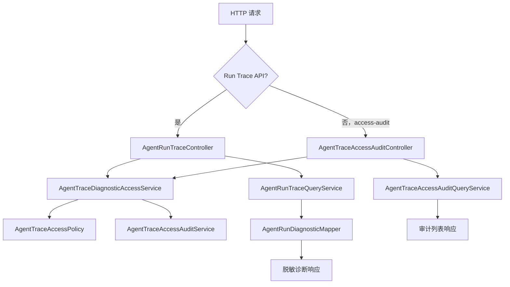

# 企业化 Trace 诊断 Controller 拆分设计

## 背景

当前 `AgentRunTraceController` 同时承担三类职责：

1. 查询单个 Agent Run Trace：`GET /api/agent-runs/{runKey}`
2. 查询会话最近 Agent Run：`GET /api/agent-runs?sessionKey=...`
3. 查询 Trace 访问审计：`GET /api/agent-runs/access-audit?...`

同时它还内联处理 API Key 授权、访问审计写入、请求参数清洗、审计查询目标解析。随着 Trace 诊断能力继续扩展，这个 Controller 会变成“入口聚合层”，后续新增运维视图、导出能力、告警关联时会越来越难 review。

本阶段目标是保持外部 API 完全兼容，把职责拆成更企业化的边界。

## 设计目标

- API 路径、请求参数、响应 JSON、HTTP 状态码保持不变。
- `AgentRunTraceController` 只负责 Run Trace 相关诊断查询。
- 新增 `AgentTraceAccessAuditController` 只负责 Trace 访问审计查询。
- 新增一个很薄的访问门面服务，统一执行“授权 + 审计写入”，避免多个 Controller 复制安全逻辑。
- 审计查询参数解析留在审计 Controller 内部，因为它是该 API 的路由语义，不属于通用授权能力。

## 方案选择

采用“拆 Controller + 抽授权审计门面”的方案。

备选方案一是只移动 `access-audit` 方法，不抽公共服务。它改动最小，但两个 Controller 都会重复 `authorize`、`recordAudit`、`clean` 等逻辑，后续加新诊断入口时复制会继续扩大。

备选方案二是把所有诊断访问规则做成拦截器或 Spring Security 过滤链。这更彻底，但当前项目还没有完整鉴权上下文，贸然引入会把本阶段从结构优化扩大成安全框架改造。

最终选定的方案足够小：保留现有 `AgentTraceAccessPolicy` 和 `AgentTraceAccessAuditService`，新增 `AgentTraceDiagnosticAccessService` 作为 Controller 专用门面。

## 组件边界

### AgentTraceDiagnosticAccessService

职责：

- 清洗请求头里的 API Key。
- 调用 `AgentTraceAccessPolicy.authorize(...)`。
- 无论允许还是拒绝，都调用 `AgentTraceAccessAuditService.record(...)` 写审计。
- 从 `HttpServletRequest` 提取远端地址。
- 返回 `AgentTraceAccessDecision` 给 Controller，由 Controller 决定继续查询或返回 403。

它不负责：

- 判断业务参数是否有效。
- 查询 Trace 或审计列表。
- 组装响应体。

### AgentRunTraceController

职责收窄为：

- `GET /api/agent-runs/{runKey}`
- `GET /api/agent-runs?sessionKey=...&limit=...`
- 调用 `AgentTraceDiagnosticAccessService` 做访问控制与审计。
- 授权通过后调用 `AgentRunTraceQueryService`。
- 用 `AgentRunDiagnosticMapper` 输出脱敏视图。

### AgentTraceAccessAuditController

职责：

- `GET /api/agent-runs/access-audit`
- 支持按目标查询：`targetType + targetKey`
- 支持按访问者查询：`actor`
- 参数缺失或不完整返回 400。
- 调用 `AgentTraceDiagnosticAccessService` 对审计查询自身进行授权与自审计。
- 授权通过后调用 `AgentTraceAccessAuditQueryService`。

## 数据流

## 错误处理

- 授权失败：返回 403，并保留 `Cache-Control: no-store`。
- 单个 Run 不存在：返回 404，并保留 `Cache-Control: no-store`。
- 审计查询参数不完整：返回 400，并保留 `Cache-Control: no-store`。
- 审计写入失败：沿用 `AgentTraceAccessAuditService` 的容错策略，只记录 warn，不影响主查询链路。

## 测试策略

- 新增 `AgentTraceDiagnosticAccessServiceTests`
  - 验证 API Key 会被 trim 后授权。
  - 验证 actor 为空时落为 `anonymous`。
  - 验证远端地址和 User-Agent 会进入审计事件。
- 拆分 WebMvc 测试
  - `AgentRunTraceControllerTests` 只覆盖 Run Trace 与 Recent Runs。
  - 新增 `AgentTraceAccessAuditControllerTests` 覆盖 access-audit 的目标查询、访问者查询、400、403。
- 保留现有 service/repository 测试，确保拆分不改变查询行为。

## 非目标

- 不新增新的权限模型。
- 不改变诊断 API Key 配置项。
- 不改变 Trace 表或审计表结构。
- 不引入 Spring Security。
- 不修改前端或外部调用协议。
