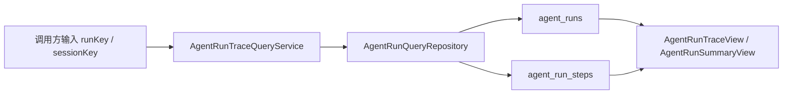

# 编排系统 Trace 查询能力设计

## 背景

前几个阶段已经为 Agent 编排系统补齐了运行轨迹写入能力：每次 Agent Run 会记录模型轮次、工具调用、工具结果、策略决策和停止原因。当前短板是 Trace 只能写入数据库，缺少统一查询入口，排查问题时仍需要手写 SQL，不利于企业化运维、审计和后续控制台展示。

本阶段目标是把 Trace 从“可记录”推进到“可检索、可展示、可定位问题”的后端基础能力。

## 目标

1. 按 `runKey` 查询单次 Agent Run 的完整轨迹，包括 run 基础信息和按 `step_index` 排序的 steps。
2. 按 `sessionKey` 查询最近 N 次 Agent Run 摘要，用于定位某个会话近期发生了什么。
3. 查询层保持只读，不影响现有写入链路和表结构。
4. 对外提供稳定 DTO，避免上层直接依赖数据库字段或 JDBC 行结构。
5. 查询失败时由 Service 层兜底，不让诊断能力影响主业务。

## 非目标

1. 本阶段不做 REST Controller 或前端页面，避免一个 commit 同时混入 API 设计、权限和 UI 决策。
2. 本阶段不新增数据库 migration，直接复用 `V45__create_agent_trace_tables.sql` 中已有索引。
3. 本阶段不做复杂筛选 DSL，只覆盖企业化排障最需要的两个查询入口。

## 设计方案

### 组件边界

- `AgentRunTraceView`：单次运行的完整视图，包含 run 元数据和 step 列表。
- `AgentRunStepView`：单个轨迹步骤视图，包含步骤类型、轮次、工具名、状态、输入/输出摘要、元数据 JSON 和创建时间。
- `AgentRunSummaryView`：会话最近运行摘要，不携带 steps，用于列表页或快速定位。
- `AgentRunQueryRepository`：只读查询接口，定义按 runKey 和 sessionKey 查询能力。
- `JdbcAgentRunQueryRepository`：JDBC 查询实现，负责 SQL 和行映射。
- `AgentRunTraceQueryService`：查询服务门面，负责参数规整、默认 limit、异常兜底。

### 数据流

### 查询语义

- `findRun(runKey)`：
  - 空 `runKey` 直接返回 `Optional.empty()`。
  - 找不到 run 返回 `Optional.empty()`。
  - 找到 run 后按 `step_index ASC` 查询 steps。
  - steps 为空时仍返回 run 视图，便于观察异常中断的运行。

- `findRecentRuns(sessionKey, limit)`：
  - 空 `sessionKey` 返回空列表。
  - `limit <= 0` 使用默认值 20。
  - `limit` 最大裁剪到 100，避免诊断查询一次性拉太多数据。
  - 按 `started_at DESC, id DESC` 返回最近运行摘要。

### 错误处理

Repository 层保持直接抛出数据库异常，便于测试和基础设施感知真实错误。Service 层捕获运行时异常并返回空结果，同时写 warn 日志。这样 Trace 查询故障不会影响主 Agent 对话链路。

### 测试策略

采用 TDD：

1. 先写 `JdbcAgentRunQueryRepositoryTests`，验证按 runKey 返回完整 steps、按 sessionKey 返回最近 N 次运行。
2. 先运行测试确认红灯，因为查询接口和实现不存在。
3. 实现 DTO、接口和 JDBC 查询。
4. 增加 `AgentRunTraceQueryServiceTests`，验证参数兜底和异常兜底。
5. 运行 Trace 相关测试和应用上下文测试。

## 后续扩展点

后续可以单独增加一个阶段：

1. `AgentRunTraceController`：暴露 `/api/agent-runs/{runKey}` 和 `/api/sessions/{sessionKey}/agent-runs`。
2. 权限与脱敏：对 userText、tool input/output 做展示级别脱敏。
3. 可观测面板：按失败率、策略跳过次数、工具失败 TopN 聚合。
