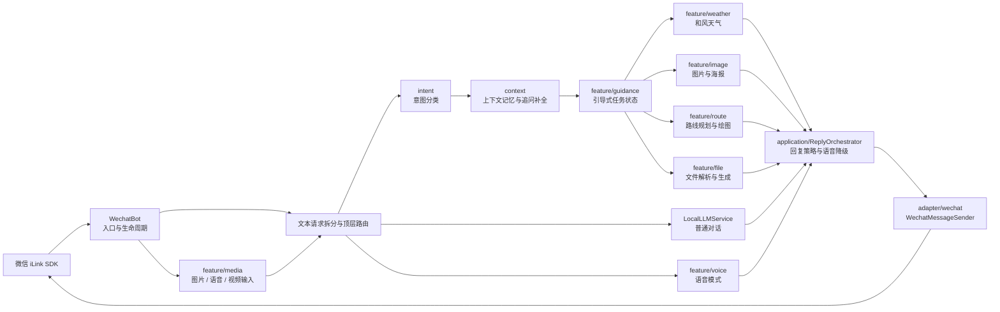
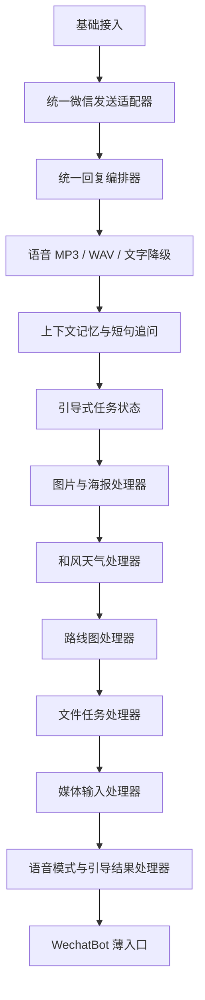
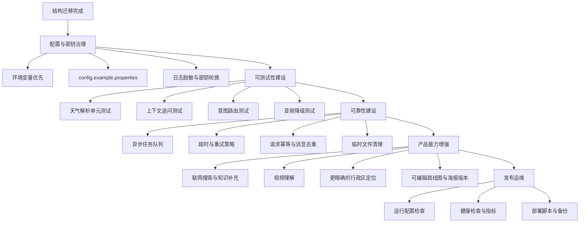

# openilink-wechat-bot 项目工作路线图

## 当前架构与消息流

## 已完成阶段

## 模块职责

| 模块 | 主要职责 | 当前状态 |
| --- | --- | --- |
| `WechatBot` | 登录、轮询、消息类型分发、顶层文本路由 | 已完成 |
| `adapter/wechat` | 隔离微信 SDK 的发送接口 | 已完成 |
| `application/ReplyOrchestrator` | 文字、MP3、WAV、文字兜底及敏感标记清理 | 已完成 |
| `feature/media` | 图片识别、SILK 语音转写、视频提示 | 已完成 |
| `feature/voice` | 用户级语音回复模式切换 | 已完成 |
| `feature/weather` | 城市/区域/日期解析、和风天气查询、上下文记录 | 已完成 |
| `feature/image` | 比例选择、图片生成、图片发送、海报满意度 | 已完成 |
| `feature/route` | 天气参考、结构化路线规划、路线图发送 | 已完成 |
| `feature/file` | 文件下载、解析、分析、生成与发送 | 已完成 |
| `feature/guidance` | 多轮追问、任务完成后的功能执行 | 已完成 |
| `context` | 最近对话、天气城市和日期上下文 | 已完成 |
| `intent` | 消息意图分类与图片提示词构建 | 已完成 |
| `speech` / `tts` / `voice` | STT、TTS、SILK 编解码和音色 | 已完成 |
| `vision` | 图片理解 | 已完成 |
| `routegen` / `map` | 结构化路线数据、绘图、地图路线补充 | 已完成 |

## 下一阶段工作路线

## 推荐实施顺序

1. 先处理配置安全：移除代码仓库中的明文 API Key，增加环境变量和示例配置。
2. 为 `WeatherHandler`、`ConversationContextService`、`IntentClassifier` 增加单元测试。
3. 将图片、路线图、TTS 和文件生成改为异步任务，避免阻塞微信消息轮询线程。
4. 增加消息去重、超时、有限重试和失败状态记录。
5. 将 `WeatherService`、`LocalLLMService`、`MediaHelper` 等根包服务继续归入 `feature` 或 `infrastructure` 包。
6. 最后补充联网搜索、视频理解和可编辑图片版本等扩展能力。

## 验收标准

- `WechatBot` 只负责生命周期、输入分发和顶层路由，不直接调用外部 API 或微信发送细节。
- 每个 feature 都可以通过构造器注入依赖，并能单独编写测试。
- 任意外部服务失败时，都有明确的用户可见兜底回复。
- 语音回复遵循 SILK、MP3、WAV、文字的降级顺序。
- 天气短句可以结合最近一次城市、区域和日期上下文。
- 图片、路线图和文件生成不会误触发普通聊天功能。
- API Key 不进入日志、提交记录或用户消息。
